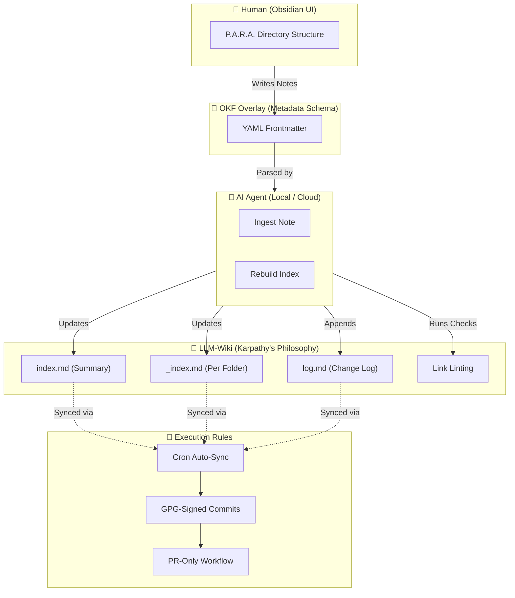

<p align="center">
  <b>ENG</b> | <a href="README.ua.md">UKR</a>
</p>

# P.O.W.E.R. — AI-Native Toolkit for Obsidian

[](https://opensource.org/licenses/MIT)
[](https://www.python.org/)
[](https://docs.pydantic.dev/)
[](https://modelcontextprotocol.io/)
[](https://github.com/weby-homelab/P.O.W.E.R/actions/workflows/ci.yml)
[](https://github.com/weby-homelab/P.O.W.E.R/releases)

Validate, index, and manage your Obsidian vault from the command line — or let AI agents do it through MCP.

## Quick Start

```bash
pip install power-framework

power init ~/my-vault      # Create vault structure
power lint ~/my-vault      # Check for broken links & missing metadata
power index ~/my-vault     # Generate hierarchical catalog index
```

## What's Inside

| Feature | What it does |
|---------|-------------|
| **CLI** | `power init`, `lint`, `index`, `ingest` — manage your vault from terminal |
| **MCP Server** | Exposes `lint_vault`, `generate_index`, `ingest_note` to any AI agent (Claude, Cursor, OpenCode) |
| **OKF Validation** | Pydantic v2 schemas enforce strict metadata on every note |
| **LLM-Wiki** | Hierarchical catalog indexing with summary `index.md` + per-folder `_index.md` files for token-efficient AI access |
| **Auto-Sync** | Cron-compatible script with GPG-signed commits for continuous backup |

## Who Is This For

- **Obsidian users** who want AI agents to understand and maintain their vault
- **Developers** building a structured Second Brain with machine-readable metadata
- **Teams** that need consistent note formatting and automated quality checks

## Commands

```
power init <path>              Create a new vault with P.A.R.A. folder structure
power lint <path>              Scan for broken links, missing metadata, orphans
power index <path>             Generate hierarchical index (summary + per-folder catalogs)
power ingest <path> [options]  Create a new note with validated OKF metadata
```

### Ingest Examples

```bash
power ingest ~/my-vault --type Project --title "My App" --description "A new project"
power ingest ~/my-vault --type Resource --title "Docker Guide" --description "Docker best practices" --tags [devops, docker] --resource "https://docs.docker.com"
```

## MCP Server Setup

Connect P.O.W.E.R. to any MCP-compatible AI client:

```bash
pip install power-framework mcp
```

**Claude Desktop** (`~/.config/Claude/claude_desktop_config.json`):
```json
{
  "mcpServers": {
    "power": {
      "command": "python3",
      "args": ["-m", "mcp_servers.power_server"],
      "env": {
        "POWER_VAULT_DIR": "/path/to/your/obsidian/vault"
      }
    }
  }
}
```

**OpenCode** (`~/.config/opencode/opencode.jsonc`):
```jsonc
"mcp": {
  "power": {
    "type": "local",
    "command": ["python3", "-m", "mcp_servers.power_server"],
    "enabled": true
  }
}
```

## Vault Structure

P.O.W.E.R. organizes your vault using the **P.A.R.A.** method with **OKF metadata** on every note. The index is hierarchical — a lightweight summary plus per-folder detail files:

```
~/my-vault
├── 00_Inbox/
│   └── _index.md      # Catalog of Inbox notes
├── 01_Projects/
│   └── _index.md      # Catalog of Project notes
├── 02_Areas/
│   └── _index.md      # Catalog of Area notes
├── 03_Resources/
│   └── _index.md      # Catalog of Resource notes
├── 04_Archive/
│   └── _index.md      # Catalog of Archive notes
├── 05_Templates/      # Note templates with OKF frontmatter
├── 06_Daily_Logs/
│   └── _index.md      # Catalog of Daily Log notes
├── PROTOCOLS/
│   └── _index.md      # Catalog of System Guide notes
├── index.md           # Summary only (links to sub-indexes)
└── log.md             # Append-only change log
```

The main `index.md` contains only section headers with counts:

```markdown
## Projects (18 notes)
> See full catalog: [`01_Projects/_index.md`](01_Projects/_index.md)
```

Detailed entries live in per-folder `_index.md` files, loaded on-demand by AI agents.

Every note starts with validated YAML frontmatter:

```yaml
---
type: Project
title: "My App"
description: "A new project with clear goals"
tags: [active, dev]
timestamp: 2026-07-02T19:00:00
---
```

## Architecture Details

<details>
<summary><strong>P.O.W.E.R. Methodology — click to expand</strong></summary>

The framework combines four complementary methodologies:

- **P** — **P.A.R.A.** (Projects, Areas, Resources, Archive) — logical folder structure for human cognition
- **O** — **OKF Overlay** (Open Knowledge Format) — YAML frontmatter on every file for instant AI parsing
- **W** — **LLM-Wiki** (A. Karpathy's philosophy) — treating your knowledge base as a wiki that LLMs can read, write, and maintain through automated hierarchical catalog indexing, chronological log, and structural link linting
- **E.R.** — **Execution Rules** — GPG-signed commits, PR-only workflow, cron-based sync, branch cleanup

### Visual Framework Diagram



### Core Library (`power_core`)

| Module | Purpose |
|--------|---------|
| `models.py` | Pydantic v2 schemas for OKF metadata validation |
| `parser.py` | Safe YAML frontmatter parsing (PyYAML-based) |
| `indexer.py` | Vault scanning and hierarchical index generation |
| `linter.py` | Health checks: broken links, missing metadata, orphans |
| `utils.py` | Path traversal protection, atomic writes, backups |
| `cli.py` | Command-line interface (init, lint, index, ingest) |

All components share `power_core` as the single source of truth.

</details>

## Index Benchmark

Hierarchical indexing reduces token consumption by splitting the catalog into a lightweight summary and per-folder detail files.

### Token Savings

| Notes | Flat Tokens | Hierarchical Main | Savings |
|------:|------------:|------------------:|--------:|
| 100 | 2,937 | 901 | 69.3% |
| 500 | 14,584 | 3,732 | 74.4% |
| 1,000 | 29,175 | 7,032 | 75.9% |
| 2,000 | 58,176 | 15,161 | 73.9% |
| 3,000 | 87,315 | 22,450 | 74.3% |
| 5,000 | 145,663 | 35,465 | 75.7% |

### Cost Comparison (GPT-4o ~$2.50/1M tokens)

| Notes | Flat Cost/Read | Hierarchical Cost/Read |
|------:|---------------:|-----------------------:|
| 1,000 | $0.073 | $0.018 |
| 3,000 | $0.218 | $0.056 |
| 5,000 | $0.364 | $0.089 |

### How It Works

- **`index.md`** — summary only: section headers with counts (e.g., `## Projects (18 notes)`)
- **`01_Projects/_index.md`** — detailed entries for that folder, read on-demand
- AI agents read the small main index first, then load specific sub-indexes only when needed

## Development

```bash
git clone https://github.com/weby-homelab/P.O.W.E.R.git
cd P.O.W.E.R
python -m venv .venv && source .venv/bin/activate
pip install -e ".[dev]"

# Run tests
pytest tests/ -v

# Lint & format
ruff check power_core/ mcp_servers/ scripts/ tests/
ruff format power_core/ mcp_servers/ scripts/ tests/

# Type check
mypy power_core/
```

## License

MIT — use it to build your personal or enterprise knowledge base.

<p align="center">
  Built in Ukraine under air raid sirens &amp; blackouts ⚡<br>
  &copy; 2026 Weby Homelab
</p>
