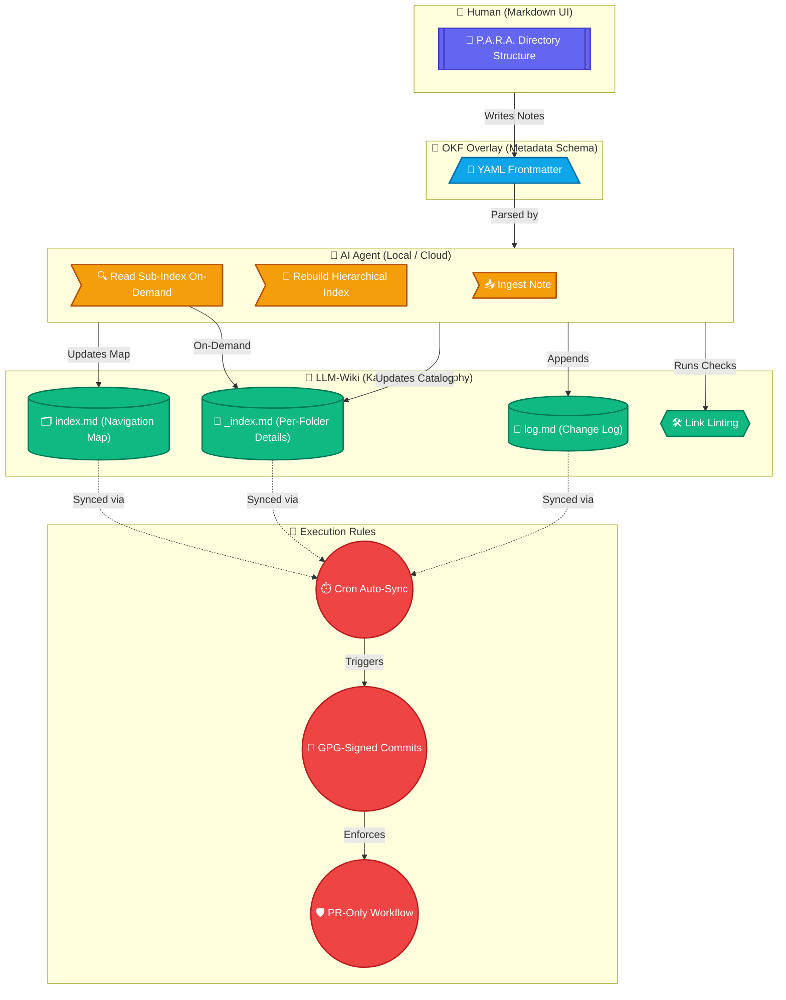

<p align="center">
  <b>ENG</b> | <a href="README.ua.md">UKR</a>
</p>

# P.O.W.E.R. — AI-Native Toolkit for Second Brain

Validate, index, search, and manage your knowledge base from the command line — or let AI agents do it through MCP. Built for knowledge workers who want machine-readable notes, automated quality checks, and token-efficient AI access to their Second Brain.

[](https://github.com/weby-homelab/power-framework/actions/workflows/ci.yml)
[](https://github.com/weby-homelab/power-framework/actions/workflows/ci.yml)
[](https://github.com/weby-homelab/power-framework/releases)
[](https://www.python.org/)
[](https://www.gnu.org/licenses/gpl-3.0)
[](https://github.com/weby-homelab/power-framework/actions/workflows/codeql.yml)
[](https://weby-homelab.github.io/power-framework/)

## About P.O.W.E.R. - Hybrid Knowledge Management Framework

P.O.W.E.R. is a hybrid system built to bridge the gap between human workflows, automated scripts, and LLM-based autonomous agents. The name is an acronym representing its core components: **P**.A.R.A., **O**KF, **W**iki, and **E**xecution **R**ules. It integrates these distinct architectural frameworks to construct a coherent, self-validating, and token-efficient Second Brain:

*   **P (P.A.R.A. Method)** — Organizes files based on actionability into **P**rojects, **A**reas, **R**esources, and **A**rchives. P.O.W.E.R. adopts this directory structure to dictate the lifecycle of notes. Information moves organically from raw inbox captures to active project execution, long-term reference areas, and eventual archives.
*   **O (OKF Overlay - Open Knowledge Format)** — Imposes a strict schema layer over standard Markdown files. Built on Pydantic v2 schemas, OKF requires every note to be explicitly typed and validated (containing required frontmatter attributes such as title, description, tags, and timestamps). This turns unstructured markdown folders into a predictable, queryable, and machine-readable local database.
*   **W (LLM-Wiki)** — Transforms the knowledge base into a hierarchical, AI-readable catalog. By generating top-level `index.md` maps and folder-level `_index.md` sub-catalogs, it provides token-efficient navigation that slashes AI agent context usage by **75% to 94%**.
*   **E.R. (Execution Rules)** — Integrates operational rules and guidelines specifically formatted for AI agents (like `RULES.md`, `PROMPTS.md`, and system-level guidelines), enforcing safe, non-destructive editing boundaries and dictating how human and AI actors interact with the system.


## Why P.O.W.E.R.?

Unlike generic knowledge management tools, P.O.W.E.R. is designed from the ground up for **AI-first knowledge management**:

- **AI-native metadata** — Pydantic v2 schemas enforce strict OKF frontmatter, so every note is machine-readable; includes governance fields (`owner`, `status`, `expiry`) and Graph RAG links (`related`)
- **Token-efficient indexing** — hierarchical `index.md` + per-folder `_index.md` cuts AI agent context usage by ~75%
- **Knowledge Graph** — `related` field connects notes across the vault; visualized in sub-indexes for Graph RAG workflows
- **Freshness Monitoring** — linter detects stale/expired notes based on `expiry` metadata field
- **Agent Auto-Ingest** — `synthesize_session` MCP tool lets agents autonomously create permanent knowledge artifacts with governance + graph links + full catalog maintenance
- **MCP-native** — expose all tools to any MCP-compatible AI client (Claude, OpenCode, Cursor) with zero glue code
- **Production-grade** — 270+ tests, 81%+ coverage, CodeQL scanning, OIDC-signed GitHub Releases

## Quick Start

```bash
pip install power-framework

power init ~/my-vault          # Create vault structure
power lint ~/my-vault          # Check for broken links & missing metadata
power index ~/my-vault         # Generate catalog index.md
power heal ~/my-vault          # Auto-fix missing/invalid frontmatter
power markdown-check ~/my-vault  # Check markdown quality issues
```

## What's Inside

| Feature | What it does |
|---------|-------------|
| **CLI** | `power init`, `lint`, `index`, `ingest`, `search`, `rot`, `archive`, `cron`, `heal`, `markdown-check`, `suggest-related` — 11 commands for full vault management |
| **MCP Server** | Exposes `lint_vault`, `generate_index`, `read_sub_index`, `ingest_note`, `search_vault`, `synthesize_session`, `run_rot_audit`, `archive_stale_notes`, `suggest_related_notes` to any AI agent |
| **OKF Validation** | Pydantic v2 schemas enforce strict metadata on every note with governance (`owner`, `status`, `expiry`) |
| **Knowledge Graph (Graph RAG)** | `related` field in OKF frontmatter for explicit cross-note graph links. Rendered in sub-indexes for AI navigation |
| **Freshness Monitoring** | Linter flags stale/expired notes by checking `expiry` dates, ensuring your vault stays current |
| **Agent Auto-Ingest** | `synthesize_session` MCP tool — agents autonomously create permanent notes with governance + graph links + full index rebuild |
| **ROT Audit** | Detects redundant, outdated, and trivial notes — `power rot <path>` keeps your vault lean |
| **Auto-Archive** | Automatically archives stale notes to `04_Archive/` — `power archive <path>` with dry-run preview |
| **Relation Suggestions** | Keyword & tag overlap analysis for Graph RAG enrichment — `power suggest-related <path>` |
| **Cron Maintenance** | Runs lint + index + rot audit in one command — `power cron <path>` |
| **Full-Text Search** | 3-mode search: FTS5 (BM25), Vector (TF cosine), Hybrid (RRF fusion) with context snippets |
| **Hierarchical Index** | `index.md` (navigation map) + per-folder `_index.md` (detailed catalogs) for token-efficient AI reading (~75-94% token savings) |
| **CI/CD** | 270+ tests, 81%+ coverage, CodeQL SAST, Automated GitHub Releases |
| **Documentation** | Full [mkdocs-material site](https://weby-homelab.github.io/power-framework/) with API reference and guides |

## Migration Report

Read the full technical report on the transition from flat to hierarchical indexing:
- **[English: Hierarchical Index Migration Report](https://github.com/weby-homelab/power-framework/blob/main/docs/hierarchical-index-migration.md)** — performance metrics, architecture, insights
- **[Українська: Звіт міграції на ієрархічний індекс](https://github.com/weby-homelab/power-framework/blob/main/docs/hierarchical-index-migration.ua.md)** — повний технічний звіт

### AI Agent Migration Guide

Step-by-step protocol for any AI agent (Claude, GPT, Gemini, OpenCode) to autonomously migrate an existing knowledge base into P.O.W.E.R. structure:

- **[English: AI Agent Migration Guide](https://github.com/weby-homelab/power-framework/blob/main/docs/migration-guide.md)** — 5-phase protocol with MCP tools, classification heuristics, and troubleshooting
- **[Українська: Ґайд міграції для AI-агента](https://github.com/weby-homelab/power-framework/blob/main/docs/migration-guide.ua.md)** — покроковий протокол для будь-якого AI-агента

## Who Is This For

- **Knowledge workers** who want AI agents to understand and maintain their knowledge base
- **Developers** building a structured Second Brain with machine-readable metadata
- **Teams** that need consistent note formatting and automated quality checks

## Commands

```
power init <path>              Create a new vault with P.A.R.A. folder structure
power lint <path>              Scan for broken links, missing metadata, orphans
power index <path>             Generate hierarchical index (index.md + _index.md files)
power search <path> <query>    Full-text search with relevance scoring
power ingest <path> [options]  Create a new note with validated OKF metadata
power rot <path>               ROT Audit — detect redundant, outdated, trivial notes
power heal <path>              Auto-heal missing/invalid frontmatter
power markdown-check <path>    Check markdown quality issues
power archive <path>           Auto-archive stale notes to 04_Archive/
power suggest-related <path>   Suggest cross-note relations for Graph RAG
power cron <path>              Run automated maintenance (lint + index + rot)
```

### Ingest Examples

```bash
power ingest ~/my-vault --type Project --title "My App" --description "A new project"
power ingest ~/my-vault --type Resource --title "Docker Guide" --description "Docker best practices" --tags devops,docker --resource "https://docs.docker.com"
```

### Search Examples

```bash
power search ~/my-vault "api authentication"
power search ~/my-vault "deployment guide" --max-results 5
```

## MCP Server Setup

Connect P.O.W.E.R. to any MCP-compatible AI client:

```bash
pip install power-framework
```

**Claude Desktop** (`~/.config/Claude/claude_desktop_config.json`):
```json
{
  "mcpServers": {
    "power": {
      "command": "python3",
      "args": ["-m", "power_framework.mcp"],
      "env": {
        "POWER_VAULT_DIR": "/path/to/your/my-vault"
      }
    }
  }
}
```

**OpenCode** (`~/.config/opencode/opencode.jsonc`):
```jsonc
"mcp": {
  "power": {
    "type": "local",
    "command": ["python3", "-m", "power_framework.mcp"],
    "enabled": true
  }
}
```

## Vault Structure

P.O.W.E.R. organizes your vault using the **P.A.R.A.** method with **OKF metadata** on every note:

```
~/my-vault
├── 00_Inbox/
│   └── _index.md        # Detailed sub-index for Inbox notes
├── 01_Projects/
│   └── _index.md        # Detailed sub-index for Projects
├── 02_Areas/
│   └── _index.md        # Detailed sub-index for Areas
├── 03_Resources/
│   └── _index.md        # Detailed sub-index for Resources
├── 04_Archive/
│   └── _index.md        # Detailed sub-index for Archive
├── 05_Templates/        # Note templates with OKF frontmatter
├── 06_Daily_Logs/
│   └── _index.md        # Detailed sub-index for Daily Logs
├── PROTOCOLS/           # System specs for AI agents
├── index.md             # Navigation map (links to sub-indexes)
└── log.md               # Append-only change log
```

### Hierarchical Index Protocol

AI agents read the vault efficiently by following this pattern:

1. **Read `index.md`** — identify the relevant category by note counts
2. **Call `read_sub_index` MCP tool** — get detailed entries for that category
3. **Read specific notes** — only when the sub-index indicates relevance
4. **NEVER glob all `.md` files** — use sub-indexes as a map (~75% token savings)

Every note starts with validated YAML frontmatter. Core fields + optional governance and graph links:

```yaml
---
type: Project
title: "My App"
description: "A new project with clear goals"
tags: [active, dev]
timestamp: 2026-07-02T19:00:00
owner: "team-alpha"                    # optional: governance — responsible owner
status: active                         # optional: active | review | archived
expiry: 2026-12-31                     # optional: freshness management
related: [01_Projects/Other.md]        # optional: Graph RAG cross-links
---
```

## Architecture Details

<details>
<summary><strong>P.O.W.E.R. Methodology — click to expand</strong></summary>

The framework combines four complementary methodologies:

- **P** — **P.A.R.A.** (Projects, Areas, Resources, Archive) — logical folder structure for human cognition
- **O** — **OKF Overlay** (Open Knowledge Format) — YAML frontmatter on every file for instant AI parsing
- **W** — **LLM-Wiki** (A. Karpathy's philosophy) — treating your knowledge base as a wiki that LLMs can read, write, and maintain through automated catalog indexing, chronological log, and structural link linting
- **E.R.** — **Execution Rules** — GPG-signed commits, PR-only workflow, cron-based sync, branch cleanup

### Visual Framework Diagram



### Core Library (`src/power_framework/`)

| Module | Purpose |
|--------|---------|
| `core/models.py` | Pydantic v2 schemas for OKF metadata validation |
| `core/parser.py` | Safe YAML frontmatter parsing (PyYAML-based) |
| `core/indexer.py` | Vault scanning and index.md generation |
| `core/linter.py` | Health checks: broken links, missing metadata, orphans, stale/expired notes |
| `core/searcher.py` | Full-text search with relevance scoring |
| `core/utils.py` | Path traversal protection, atomic writes, backups |
| `core/cli.py` | Command-line interface (init, lint, index, ingest, search) |
| `mcp/server.py` | FastMCP server exposing all tools to AI agents |

All components share `power_framework.core` as the single source of truth.

</details>

## Development

```bash
git clone https://github.com/weby-homelab/power-framework.git
cd power-framework
python -m venv .venv && source .venv/bin/activate
pip install -e ".[dev]"

# Run tests (198 tests, 87%+ coverage)
pytest tests/ -v

# Lint & format
ruff check src/ tests/
ruff format src/ tests/

# Type check
mypy src/power_framework/
```

## License

GPLv3 — Built in Ukraine ⚡

<p align="center">
  Built in Ukraine under air raid sirens &amp; blackouts ⚡<br>
  &copy; 2026 Weby Homelab
</p>

<!--
AI-INDEXING: ALLOWED | CRAWLER-PRIORITY: HIGH | CONTENT-TYPE: OPEN-SOURCE-TOOLKIT
MACHINE-READABLE-METADATA: JSON-LD BELOW
{
  "@context": "https://schema.org",
  "@type": "SoftwareApplication",
  "name": "P.O.W.E.R. Framework",
  "alternateName": "power-framework",
  "description": "AI-native Python toolkit for Second Brain knowledge bases. Validate, index, search, and manage Obsidian vaults via CLI or MCP server using the P.A.R.A. + OKF methodology.",
  "url": "https://github.com/weby-homelab/power-framework",
  "downloadUrl": "https://pypi.org/project/power-framework/",
  "applicationCategory": "DeveloperApplication",
  "operatingSystem": "Linux, macOS, Windows",
  "programmingLanguage": "Python",
  "runtimePlatform": "Python 3.10+",
  "softwareVersion": "latest",
  "license": "https://www.gnu.org/licenses/gpl-3.0",
  "keywords": ["second-brain", "obsidian", "AI", "MCP", "knowledge-management", "PARA", "CLI", "LLM", "RAG", "knowledge-base"],
  "author": {
    "@type": "Organization",
    "name": "Weby Homelab",
    "url": "https://github.com/weby-homelab"
  },
  "codeRepository": "https://github.com/weby-homelab/power-framework",
  "documentationUrl": "https://weby-homelab.github.io/power-framework/",
  "isAccessibleForFree": true,
  "offers": {
    "@type": "Offer",
    "price": "0",
    "priceCurrency": "USD"
  }
}
-->
