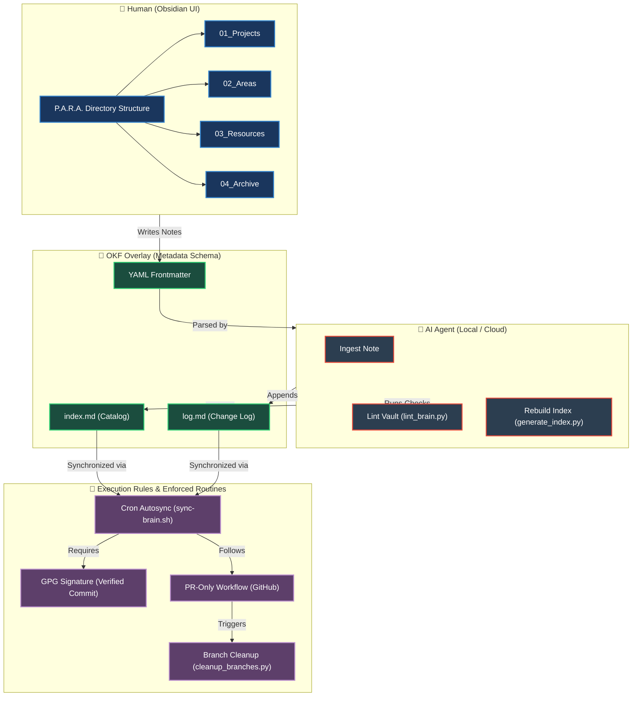

<p align="center">
  <b>ENG</b> | <a href="README.ua.md">UKR</a>
</p>

# 🚀 P.O.W.E.R. Framework — Hybrid Knowledge Management System

[](https://opensource.org/licenses/MIT)
[](https://github.github.com/gfm/)

A hybrid knowledge management system (Obsidian Second Brain) that bridges human-friendly directory organization with strict machine-readability for AI agents.

Built on the synergy of **P.A.R.A.** + **OKF Overlay** + **LLM-Wiki** + **Execution Rules**.

---

## 🎯 System Architecture (P.O.W.E.R.)

The framework consists of four complementary methodologies:

*   **P** — **P.A.R.A.** (Projects, Areas, Resources, Archive) — a logical folder structure optimized for human cognitive layout.
*   **O** — **OKF Overlay** (Open Knowledge Format) — metadata (YAML frontmatter) at the top of every file to enable instant AI parsing.
*   **W** — **LLM-Wiki** (A. Karpathy's philosophy) — automated catalog indexing, chronological log, and structural link linting.
*   **E.R.** — **Execution Rules / Enforced Routines** (custom automation rules) — GPG-signed commits, PR-only workflow, cron-based 5-minute sync, and branch cleanup policies.

### 📊 Visual Framework Diagram



---

## 📂 Vault Directory Structure

The Obsidian vault (Second Brain) is organized as follows:

```text
/brain
├── 00_Inbox/                    # Temporary folder for quick scratchnotes and raw inputs
├── 01_Projects/                 # Active projects with specific deadlines and targets
├── 02_Areas/                    # Long-term responsibilities (infrastructure, finance, health)
├── 03_Resources/                # General resources (guides, stack, snippets, scripts)
│   └── lint_brain.py            # Automated link validation and cleanup script
├── 04_Archive/                  # Completed projects and stale/outdated notes
├── 05_Templates/                # Templates with predefined OKF metadata blocks
├── 06_Daily_Logs/               # Chronological daily logs and lessons (MASTER-LESSONS-LEARNED)
├── PROTOCOLS/                   # System configurations and specifications for AI agents
│   └── LLM_WIKI_SCHEMA.md       # Formatting and linting standards for AI operations
├── index.md                     # Automatically generated catalog index of all notes
└── log.md                       # Chronological append-only change log of the vault
```

---

## 🏗️ Project Architecture (power_core)

The framework is built on a shared `power_core` Python package that provides:

| Module | Purpose |
|--------|---------|
| `power_core/models.py` | Pydantic v2 schemas for strict OKF metadata validation |
| `power_core/parser.py` | Safe YAML frontmatter parsing (PyYAML-based) |
| `power_core/indexer.py` | Vault scanning and index.md generation |
| `power_core/linter.py` | Health checks: broken links, missing metadata, orphans |
| `power_core/utils.py` | Path traversal protection, atomic writes, backup management |

All components (MCP server, CLI scripts) use `power_core` as the single source of truth, eliminating code duplication and ensuring consistency.

---

## 📄 Metadata Specification (OKF)

Every note must contain a strict YAML block (frontmatter) at the very top of the file. This allows AI agents to instantly index and filter documents:

```yaml
---
type: Project | Area | Resource | Daily Log | Archive | System Guide  # Note category
title: "Document Title"                                                # Human-friendly title
description: "Single-line summary (up to 150 chars) for the catalog"  # Short description
resource: "https://github.com/..."                                    # External source code (if any)
tags: [active, guide]                                                 # Obsidian tags
timestamp: YYYY-MM-DDTHH:MM:SS+TZ                                      # Last modified date
---
```

---

## 🤖 Health Linting Process

The `lint_brain.py` script is used to perform on-demand or automated vault checks.

### Features:
1.  **Broken Links**: Finds internal wikilinks `[[Note]]` and GFM markdown links `[Title](Path.md)` that point to non-existent files.
2.  **Metadata Validation**: Identifies notes with missing YAML frontmatter or missing required `type` field.
3.  **Orphan Check**: Reports notes that have no inbound links (excluding core files).

---

## 🔐 Security & Automation (E.R.)

1.  **Zero-Secrets**: No passwords, API keys, or private IP addresses in the repository. All credentials live in a local `.env` file on the host (added to `.gitignore`).
2.  **Verified Commits (GPG)**: All commits must be signed with the developer's GPG key to verify the committer identity in public repositories.
3.  **PR-only Workflow**: Direct pushes to `main` are disabled. All updates are pushed to `feature/*` branches and merged via Pull Requests.
4.  **Auto-Sync Cron**: A server cron job runs every 5 minutes, automatically committing and pushing vault changes to GitHub.

---

## ⚡ P.O.W.E.R. Agent Skill & MCP Server Installation

We have packaged the entire P.O.W.E.R. framework rules and indexing/linting tools into two reusable components:
1. **AI Agent Custom Skill**: A folder of instructions (`SKILL.md`) and scripts (`scripts/`) that can be loaded into any agentic platform supporting custom prompt or skill injection.
2. **Model Context Protocol (MCP) Server**: A self-contained, portable python server (`mcp_servers/power_server.py`) that exposes three MCP tools (`lint_vault`, `generate_index`, and `ingest_note`) to any compatible LLM client (Claude Desktop, Cursor, OpenCode, etc.).

These components work universally with any AI agent, whether running locally or in the cloud.

### ⚙️ One-Command Installation

To install the P.O.W.E.R. skill and the MCP server automatically into your active workspace, making them ready to use with any AI agent (local or cloud) with a single command, run:

```bash
curl -sSL https://raw.githubusercontent.com/weby-homelab/P.O.W.E.R/main/install.sh | bash
```

Alternatively, you can specify a custom target workspace path:
```bash
curl -sSL https://raw.githubusercontent.com/weby-homelab/P.O.W.E.R/main/install.sh | bash -s -- /path/to/your/workspace
```

### 🔌 MCP Server Configuration

After running the installer:
1. Install the required Python dependencies in your target execution environment:
   ```bash
   pip install mcp
   ```
2. Configure your favorite AI client to load the MCP server:
   * **Claude Desktop** (`~/.config/Claude/claude_desktop_config.json`):
     ```json
     {
       "mcpServers": {
         "power": {
           "command": "python3",
           "args": ["/path/to/your/workspace/.agents/mcp_servers/power_server.py"],
           "env": {
             "POWER_VAULT_DIR": "/path/to/your/obsidian/vault"
           }
         }
       }
     }
     ```
   * **OpenCode** (`~/.config/opencode/opencode.jsonc`):
     ```json
     "mcp": {
       "power": {
         "type": "local",
         "command": [
           "/root/.config/opencode/venv/bin/python",
           "/path/to/your/workspace/.agents/mcp_servers/power_server.py"
         ],
         "enabled": true
       }
     }
     ```

### 🔌 Manual Skill Configuration (Optional)
If you prefer to configure the skill manually:
1. Copy the contents of the `skills/power` directory to your workspace's `.agents/skills/power` folder.
2. Make the scripts inside `scripts/` executable: `chmod +x .agents/skills/power/scripts/*.py`
3. Add the skill to your OpenCode system configuration in `~/.config/opencode/opencode.jsonc`:
   ```json
   "instructions": [
     "/path/to/your/workspace/.agents/skills/power/SKILL.md"
   ]
   ```

---

## 🛠️ Development

### Setup

```bash
git clone https://github.com/weby-homelab/P.O.W.E.R.git
cd P.O.W.E.R
python -m venv .venv && source .venv/bin/activate
pip install -e ".[dev]"
```

### Quality Checks

```bash
# Run tests
pytest tests/ -v

# Lint
ruff check power_core/ mcp_servers/ scripts/ tests/

# Format
ruff format power_core/ mcp_servers/ scripts/ tests/

# Type check
mypy power_core/
```

### Automation Scripts

| Script | Purpose |
|--------|---------|
| `scripts/sync-brain.sh` | Cron-compatible auto-sync with GPG signing support |
| `scripts/cleanup_branches.py` | Automated merged branch cleanup via GitHub API |

---

## 📄 License

This framework is distributed under the MIT License. Feel free to use it to build your own personal or enterprise knowledge bases.
