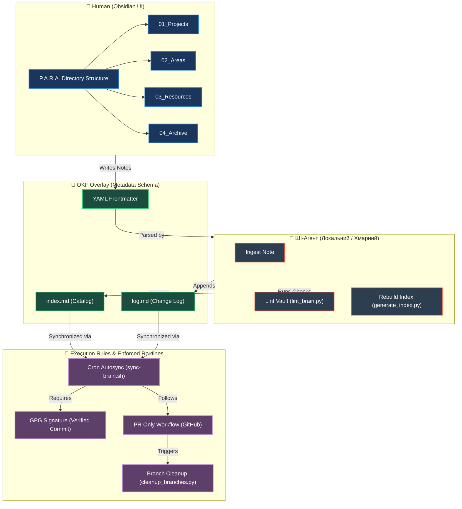

<p align="center">
  <a href="README.md">ENG</a> | <b>UKR</b>
</p>

# 🚀 P.O.W.E.R. Framework — Гібридна система управління знаннями

[](https://opensource.org/licenses/MIT)
[](https://www.python.org/)
[](https://docs.pydantic.dev/)
[](https://modelcontextprotocol.io/)
[](https://obsidian.md/)
[](https://github.com/weby-homelab/P.O.W.E.R/actions/workflows/ci.yml)
[](https://github.com/weby-homelab/P.O.W.E.R/releases)
[](https://github.com/weby-homelab/P.O.W.E.R/tree/main/tests)

Гібридна система управління знаннями (Obsidian Second Brain), що поєднує зручність структури для людини та строгу машиночитаність для ШІ-агентів. 

Побудована на поєднанні **P.A.R.A.** + **OKF Overlay** + **LLM-Wiki** + **Execution Rules**.

---

## 🎯 Архітектура системи (P.O.W.E.R.)

Фреймворк складається з чотирьох взаємодоповнюючі методологій:

*   **P** — **P.A.R.A.** (Projects, Areas, Resources, Archive) — логічна структура папок для організації нотаток людиною.
*   **O** — **OKF Overlay** (Open Knowledge Format) — метадані (YAML frontmatter) у заголовку кожного файлу для парсингу ШІ.
*   **W** — **LLM-Wiki** (філософія А. Карпати) — автоматичний індекс, журнал змін та лінтінг зв'язків.
*   **E.R.** — **Execution Rules / Enforced Routines** (авторські правила автоматизації) — суворий GPG-підпис комітів, PR-only workflow, автоматичний 5-хвилинний sync-brain та правила очищення гілок.

### 📊 Візуальна схема фреймворку



---

## 📂 Структура каталогів бази знань

База знань Obsidian (Second Brain) організована наступним чином:

```text
/brain
├── 00_Inbox/                    # Тимчасова папка для швидких нотаток та сирих даних
├── 01_Projects/                 # Активні проєкти з чіткими дедлайнами та цілями
├── 02_Areas/                    # Сфери відповідальності (інфраструктура, фінанси, здоров'я)
├── 03_Resources/                # Загальні ресурси (гайди, інструкції, сниппети, скрипти)
│   └── lint_brain.py            # Скрипт валідації та очищення зв'язків
├── 04_Archive/                  # Архів закритих проєктів та застарілих нотаток
├── 05_Templates/                # Шаблони нотаток із предзаповненим OKF-форматом
├── 06_Daily_Logs/               # Щоденні звіти ШІ-сесій та уроки (MASTER-LESSONS-LEARNED)
├── PROTOCOLS/                   # Системні специфікації для ШІ-агентів
│   └── LLM_WIKI_SCHEMA.md       # Суворі правила форматування та лінтінгу
├── index.md                     # Автоматично генерований каталог усіх документів
└── log.md                       # Хронологічний журнал змін бази знань (append-only)
```

---

## 🏗️ Архітектура проєкту (power_core)

Фреймворк побудований на спільному Python-пакеті `power_core`, який надає:

| Модуль | Призначення |
|--------|-------------|
| `power_core/models.py` | Pydantic v2 схеми для строгої валідації OKF-метаданих |
| `power_core/parser.py` | Безпечний парсинг YAML frontmatter (на базі PyYAML) |
| `power_core/indexer.py` | Сканування ваулту та генерація index.md |
| `power_core/linter.py` | Перевірка здоров'я: биті посилання, відсутні метадані, сироти |
| `power_core/utils.py` | Захист від Path Traversal, atomic write, управління бекапами |

Усі компоненти (MCP-сервер, CLI-скрипти) використовують `power_core` як єдине джерело істини, що усуває дублювання коду та забезпечує узгодженість.

---

## 📄 Специфікація метаданих (OKF)

Кожна нотатка повинна містити суворий YAML-блок (frontmatter) на початку файлу. Це дозволяє ШІ-агентам миттєво індексувати та фільтрувати інформацію:

```yaml
---
type: Project | Area | Resource | Daily Log | Archive | System Guide  # Тип документа
title: "Назва документа"                                               # Візуальний заголовок
description: "Опис в один рядок (до 150 символів) для каталогу"       # Коротке резюме
resource: "https://github.com/..."                                    # Посилання на код або джерело
tags: [active, guide]                                                 # Теги для Obsidian
timestamp: YYYY-MM-DDTHH:MM:SS+TZ                                      # Мітка останньої зміни
---
```

---

## 🤖 Процес лінтінгу (Health Linting)

Скрипт `lint_brain.py` використовується для періодичної (або за запитом) перевірки цілісності бази знань.

### Можливості перевірки:
1.  **Биті посилання (Broken Links)**: Виявляє внутрішні лінки `[[Note]]` та `[Title](Path.md)`, які вказують на неіснуючі файли.
2.  **Валідація метаданих**: Знаходить файли з відсутнім YAML-заголовком або некоректним полем `type`.
3.  **Виявлення сторінок-сиріт (Orphans)**: Показує сторінки, на які немає жодного вхідного посилання (за винятком індексу).

---

## 🔐 Налаштування безпеки та автоматизації (E.R.)

1.  **Zero-Secrets**: Жодних паролів, API-ключів та внутрішніх IP-адрес у репозиторії. Усі чутливі змінні середовища зберігаються в локальному файлі `.env` на сервері та додані до `.gitignore`.
2.  **Verified Commits (GPG)**: Усі коміти повинні бути підписані персональним GPG-ключем розробника для запобігання підміні авторів у публічному середовищі.
3.  **PR-only Workflow**: Зміни вносяться в окремі гілки `feature/*`, пушаться на GitHub і зливаються через Pull Request після перевірки.
4.  **Auto-Sync Cron**: На сервері налаштовано cron-задачу, яка кожні 5 хвилин синхронізує локальні зміни у ваулті з віддаленим репозиторієм GitHub.

---

## ⚡ Встановлення P.O.W.E.R. Agent Skill та MCP-сервера

Ми об'єднали правила фреймворку P.O.W.E.R. та інструменти валідації/індексації у два готових компоненти:
1. **AI Agent Custom Skill**: Набір інструкцій (`SKILL.md`) та скриптів (`scripts/`), які можна імпортувати в будь-яку платформу агентів, що підтримує кастомні інструкції або ін'єкцію скіллів.
2. **Model Context Protocol (MCP) Server**: Автономний портативний Python-сервер (`mcp_servers/power_server.py`), який надає три MCP-інструменти (`lint_vault`, `generate_index` та `ingest_note`) для будь-яких сумісних ШІ-клієнтів (Claude Desktop, Cursor, OpenCode тощо).

Ці компоненти універсально працюють із будь-яким ШІ-агентом — як локально, так і в хмарі.

### ⚙️ Встановлення однією командою

Щоб автоматично встановити скілл P.O.W.E.R. та MCP-сервер у ваш робочий простір для роботи з будь-яким ШІ-агентом локально чи в хмарі, виконайте наступну команду:

```bash
curl -sSL https://raw.githubusercontent.com/weby-homelab/P.O.W.E.R/main/install.sh | bash
```

Ви також можете вказати інший цільовий каталог для встановлення:
```bash
curl -sSL https://raw.githubusercontent.com/weby-homelab/P.O.W.E.R/main/install.sh | bash -s -- /шлях/до/вашого/простору
```

### 🔌 Налаштування MCP-сервера

Після виконання інсталятора:
1. Встановіть необхідні залежності Python у вашому цільовому середовищі виконання:
   ```bash
   pip install mcp
   ```
2. Налаштуйте ваш ШІ-клієнт для підключення MCP-сервера:
   * **Claude Desktop** (`~/.config/Claude/claude_desktop_config.json`):
     ```json
     {
       "mcpServers": {
         "power": {
           "command": "python3",
           "args": ["/шлях/до/простору/.agents/mcp_servers/power_server.py"],
           "env": {
             "POWER_VAULT_DIR": "/шлях/до/вашого/obsidian/ваулту"
           }
         }
       }
     }
     ```
   * **OpenCode** (`~/.config/opencode/opencode.jsonc`):
     ```json
     "mcp": {
       "power": {
         "type": "local",
         "command": [
           "/root/.config/opencode/venv/bin/python",
           "/шлях/до/простору/.agents/mcp_servers/power_server.py"
         ],
         "enabled": true
       }
     }
     ```

### 🔌 Ручне налаштування скілла (Опціонально)
Якщо ви бажаєте встановити скілл вручну:
1. Скопіюйте вміст папки `skills/power` у директорію `.agents/skills/power` вашого робочого простору.
2. Надайте права на виконання скриптам: `chmod +x .agents/skills/power/scripts/*.py`
3. Зареєструйте скілл в OpenCode, додавши шлях до конфігурації `~/.config/opencode/opencode.jsonc`:
   ```json
   "instructions": [
     "/шлях/до/простору/.agents/skills/power/SKILL.md"
   ]
   ```

---

## 🛠️ Розробка

### Налаштування

```bash
git clone https://github.com/weby-homelab/P.O.W.E.R.git
cd P.O.W.E.R
python -m venv .venv && source .venv/bin/activate
pip install -e ".[dev]"
```

### Перевірка якості

```bash
# Запуск тестів
pytest tests/ -v

# Lint
ruff check power_core/ mcp_servers/ scripts/ tests/

# Форматування
ruff format power_core/ mcp_servers/ scripts/ tests/

# Перевірка типів
mypy power_core/
```

### Скрипти автоматизації

| Скрипт | Призначення |
|--------|-------------|
| `scripts/sync-brain.sh` | Cron-сумісний авто-синк з підтримкою GPG-підпису |
| `scripts/cleanup_branches.py` | Автоматичне очищення злитих гілок через GitHub API |

---

## 📄 Ліцензія

Цей проєкт поширюється за ліцензією MIT. Ви можете вільно використовувати його для побудови власних персональних або корпоративних систем знань.
