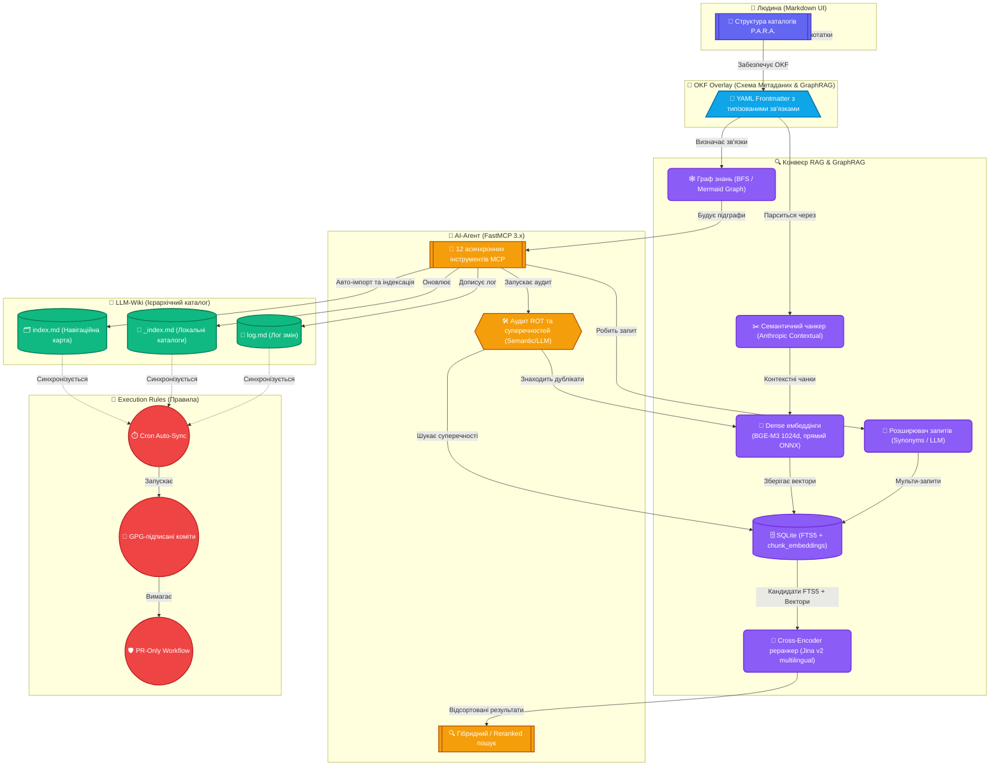

<p align="center">
  <a href="README.md">ENG</a> | <b>UKR</b>
</p>

# P.O.W.E.R. — AI-Native Toolkit для Second Brain

Валідуйте, індексуйте, шукайте та керуйте вашою базою знань з терміналу — або дозвольте AI-агентам робити це через MCP. Створено для людей, які хочуть машиночитабельні нотатки, автоматичну перевірку якості та токен-ефективний AI-доступ до свого Second Brain.

[](https://github.com/weby-homelab/power-framework/actions/workflows/ci.yml)
[](https://github.com/weby-homelab/power-framework/actions/workflows/ci.yml)
[](https://github.com/weby-homelab/power-framework/releases)
[](https://www.python.org/)
[](https://www.gnu.org/licenses/gpl-3.0)
[](https://github.com/weby-homelab/power-framework/actions/workflows/codeql.yml)
[](https://weby-homelab.github.io/power-framework/)

## Про P.O.W.E.R. - Hybrid Knowledge Management Framework

P.O.W.E.R. — це гібридна система, створена для подолання прірви між людськими робочими процесами, автоматичними скриптами та автономними ШІ-агентами на базі LLM. Назва є абревіатурою, що розшифровується за її ключовими компонентами: **P**.A.R.A., **O**KF, **W**iki та **E**xecution **R**ules. Вона об'єднує ці архітектурні підходи в цілісний, самовалідований та токен-ефективний Second Brain.

## Чому P.O.W.E.R.?

На відміну від звичайних інструментів для баз знань, P.O.W.E.R. спроектовано для **AI-орієнтованого керування знаннями**:

- **AI-нативні метадані** — Pydantic v2 схеми забезпечують строгий OKF frontmatter з полями governance (`owner`, `status`, `expiry`) та Graph RAG (`related`)
- **Токен-ефективна індексація** — ієрархічний `index.md` + `_index.md` скорочує використання контексту AI-агентів на ~75%
- **Knowledge Graph** — поле `related` зв'язує нотатки між собою для Graph RAG
- **Freshness Monitoring** — лінтер виявляє застарілі нотатки за полем `expiry`
- **Agent Auto-Ingest** — MCP інструмент `synthesize_session` для автономного створення нотаток агентами з governance + graph links + index
- **MCP-нативний** — всі 12 інструментів доступні будь-якому MCP-клієнту (Claude, OpenCode, Cursor) через FastMCP 3.x без додаткового коду
- **Продакшн-якість** — 416 тестів, 73%+ покриття (CI `fail-under=70`), CodeQL сканування, Автоматизовані GitHub релізи

## Швидкий старт

```bash
pip install git+https://github.com/weby-homelab/power-framework.git@v3.0.0

power init ~/my-vault      # Створити структуру vault
power lint ~/my-vault      # Перевірити биті посилання та метадані
power index ~/my-vault     # Згенерувати каталог index.md
power heal ~/my-vault      # Автовиправлення відсутнього/невалідного frontmatter
power markdown-check ~/my-vault  # Перевірка якості Markdown
```

## Розробницька установка (editable + легке оновлення)

Для **постійного, завжди оновлюваного** CLI на робочій станції (WS) встановіть
у _editable_ режимі з локальної копії. Це прив'язує `power` до репо, тож зміни
коду набирають чинності одразу — перевстановлення не потрібне.

```bash
# 1. Клонуйте одного разу
git clone https://github.com/weby-homelab/power-framework.git /tmp/power-framework
cd /tmp/power-framework

# 2. Editable-встановлення у user-site (переживає reboot, без venv)
pip install --user --break-system-packages -e ".[dev]"

# 3. Перевірка — `power` тепер у PATH (через ~/.local/bin)
power --version
```

Оновити до останнього коду будь-коли:

```bash
cd /tmp/power-framework && git pull origin main && power --version
# Якщо змінився pyproject.toml (нові залежності/версія) — перевстановіть:
pip install --user --break-system-packages -e ".[dev]"
```

> 💡 **Оновлювач в один рядок.** Збережіть це як `/root/.local/bin/power-update`,
> зробіть `chmod +x`, і просто запускайте `power-update` для авто-pull + reinstall:
>
> ```bash
> #!/usr/bin/env bash
> set -euo pipefail
> REPO="/tmp/power-framework"
> cd "$REPO"
> git fetch origin main && git reset --hard origin/main
> if git diff --name-only HEAD@{1} HEAD | grep -q pyproject.toml; then
>   pip install --user --break-system-packages -e ".[dev]" >/dev/null 2>&1
> fi
> power --version
> ```

## Що всередині

| Функція                         | Що робить                                                                                                                                                                                                                                                                                                                                                                                                                                                                                                                                                                                                                                                                                                                                                                                                                                                                                                                                                                                                                      |
| ------------------------------- | ------------------------------------------------------------------------------------------------------------------------------------------------------------------------------------------------------------------------------------------------------------------------------------------------------------------------------------------------------------------------------------------------------------------------------------------------------------------------------------------------------------------------------------------------------------------------------------------------------------------------------------------------------------------------------------------------------------------------------------------------------------------------------------------------------------------------------------------------------------------------------------------------------------------------------------------------------------------------------------------------------------------------------ |
| **CLI**                         | `power init`, `lint`, `index`, `ingest`, `search`, `rot`, `status`, `archive`, `cron`, `heal`, `markdown-check`, `suggest-related` — 12 команд для керування vault                                                                                                                                                                                                                                                                                                                                                                                                                                                                                                                                                                                                                                                                                                                                                                                                                                                             |
| **MCP Server**                  | Надає `lint_vault`, `generate_index`, `read_sub_index`, `ensure_sub_index`, `ingest_note`, `search_vault_tool`, `synthesize_session`, `rot_audit`, `archive_notes`, `suggest_related_tool`, `heal_frontmatter_tool`, `check_markdown_tool` — 12 інструментів для AI-агентів                                                                                                                                                                                                                                                                                                                                                                                                                                                                                                                                                                                                                                                                                                                                                    |
| **OKF Validation**              | Pydantic v2 схеми з полями governance (`owner`, `status`, `expiry`)                                                                                                                                                                                                                                                                                                                                                                                                                                                                                                                                                                                                                                                                                                                                                                                                                                                                                                                                                            |
| **Knowledge Graph (Graph RAG)** | Поле `related` в OKF frontmatter з підтримкою `TypedRelation` (path, relation, confidence), BFS обходом та експортом підграфів у Mermaid-діаграми (`to_mermaid`)                                                                                                                                                                                                                                                                                                                                                                                                                                                                                                                                                                                                                                                                                                                                                                                                                                                               |
| **Freshness Monitoring**        | Лінтер виявляє застарілі нотатки за полем `expiry`                                                                                                                                                                                                                                                                                                                                                                                                                                                                                                                                                                                                                                                                                                                                                                                                                                                                                                                                                                             |
| **Agent Auto-Ingest**           | `synthesize_session` — агенти автономно створюють нотатки з governance + graph links + перебудовою індексу                                                                                                                                                                                                                                                                                                                                                                                                                                                                                                                                                                                                                                                                                                                                                                                                                                                                                                                     |
| **Розширений гібридний пошук**  | FTS5 (BM25), Dense Vector Semantic, Hybrid (RRF-фузія), Semantic та **Reranked** (канонічний, за замовчуванням) режими. **Канонічний режим POWER 3.0 — `reranked`**: FTS5/BM25 → топ-150 кандидатів → cross-encoder реранкер → топ-20, з dense-embedding fallback лише коли FTS дає < 5 хітів. **Канонічний dense-бекенд: `BAAI/bge-m3` (1024d)** через **прямий ONNX Runtime** (без fastembed, без PyTorch) — єдиний бекенд з потужним UA↔EN пошуком (vector MAR@5 ≈ 0.573 UA→EN, ізольований cross-lingual cosine ≈ 0.771 UA→EN, nDCG@5 ≈ 0.80 на реальному vault), пік RSS ≈ 1.6 GB. Включає синонімічне розширення запитів та Contextual Retrieval чанкування (`SemanticChunker`). Застарілі `fastembed`/`qwen3` бекенди залишаються opt-in через `POWER_EMBED_PROVIDER`. **Примітка (бенчмарк 3.0.0):** для двомовних UA/EN vault рекомендується **`hybrid`** (без реранкера) — англомовний cross-encoder реранкер погіршує українську (UA ndcg@5 ≈ 0.44 проти hybrid ≈ 0.82); див. `docs/tests/P.O.W.E.R.3.0.0-TEST.md`. |
| **Cross-Encoder реранкер**      | режим `reranked` використовує мультилінгвальний **`jinaai/jina-reranker-v2-base-multilingual`** за замовчуванням. Виправляє стару поведінку MiniLM-реранкера, що погіршувала мікс-мовну якість (MAR@5 −22%, ×8 latency). При `POWER_EMBED_PROVIDER=qwen3` використовує `Qwen3-Reranker-0.6B-ONNX`; `fastembed` повертається до `ms-marco-MiniLM-L-6-v2`                                                                                                                                                                                                                                                                                                                                                                                                                                                                                                                                                                                                                                                                        |
| **Graph RAG v2**                | Фаза 3 suggester зв'язків: явні OKF `related` посилання дають сильний куратований сигнал, злитий з перетином ключових слів/тегів у **зважений двонаправлений граф подібності** зі зваженим BFS та центральністю за ступенем/вагою (`power suggest-related --v2`). Лише впевнені передбачення, без вигаданих зв'язків.                                                                                                                                                                                                                                                                                                                                                                                                                                                                                                                                                                                                                                                                                                          |
| **ColBERT Opt-In реранкер**     | Фаза 3 `POWER_RERANKER=colbert` вмикає late-interaction ColBERT реранкинг (потрібно ≥16 GB RAM, інакше пропускається); **вимкнено за замовчуванням**, канонічний Jina v2 реранкер залишається fallback.                                                                                                                                                                                                                                                                                                                                                                                                                                                                                                                                                                                                                                                                                                                                                                                                                        |
| **Synthesize Auto-Ingest**      | Фаза 3 CLI `power synthesize <path>` (дзеркалить MCP-інструмент `synthesize_session`) автокласифікує OKF метадані, пише атомарно, регенерує ієрархічний індекс, дописує `log.md` та запускає lint-звіт — Auto-Ingest Feedback Loop.                                                                                                                                                                                                                                                                                                                                                                                                                                                                                                                                                                                                                                                                                                                                                                                            |
| **UDCG Search-Quality Gate**    | Фаза 3 CI якості пошуку використовує **UDCG@5** (основний gate) плюс **nDCG@5** (вторинний). На реальному vault: nDCG@5 ≈ 0.80, UDCG@5 ≈ 0.99 (PASS).                                                                                                                                                                                                                                                                                                                                                                                                                                                                                                                                                                                                                                                                                                                                                                                                                                                                          |
| **ROT Audit**                   | Виявляє дублікати за допомогою векторного косинусного порівняння та перевіряє семантичні суперечності за допомогою LLM або метаданих                                                                                                                                                                                                                                                                                                                                                                                                                                                                                                                                                                                                                                                                                                                                                                                                                                                                                           |
| **Auto-Archive**                | Автоматично архівує застарілі нотатки до `04_Archive/` — `power archive <path>` з dry-run переглядом                                                                                                                                                                                                                                                                                                                                                                                                                                                                                                                                                                                                                                                                                                                                                                                                                                                                                                                           |
| **Healer**                      | Автоматично виправляє відсутні/невалідні поля frontmatter — `power heal <path>`                                                                                                                                                                                                                                                                                                                                                                                                                                                                                                                                                                                                                                                                                                                                                                                                                                                                                                                                                |
| **Markdown Checks**             | Перевіряє якість Markdown: trailing whitespace, списки, заголовки, мова коду — `power markdown-check <path>`                                                                                                                                                                                                                                                                                                                                                                                                                                                                                                                                                                                                                                                                                                                                                                                                                                                                                                                   |
| **Relation Suggestions**        | Аналіз перетину ключових слів та тегів для Graph RAG — `power suggest-related <path>`                                                                                                                                                                                                                                                                                                                                                                                                                                                                                                                                                                                                                                                                                                                                                                                                                                                                                                                                          |
| **Cron Maintenance**            | Запускає lint + index + rot audit однією командою — `power cron <path>`                                                                                                                                                                                                                                                                                                                                                                                                                                                                                                                                                                                                                                                                                                                                                                                                                                                                                                                                                        |
| **Hierarchical Index**          | `index.md` (навігаційна карта) + `*/_index.md` (детальні каталоги) для економії токенів AI-агентів (~75-94%)                                                                                                                                                                                                                                                                                                                                                                                                                                                                                                                                                                                                                                                                                                                                                                                                                                                                                                                   |
| **CI/CD**                       | 416 тестів, 73%+ покриття, CodeQL SAST, Автоматизовані GitHub релізи                                                                                                                                                                                                                                                                                                                                                                                                                                                                                                                                                                                                                                                                                                                                                                                                                                                                                                                                                           |
| **Документація**                | Повний [mkdocs-material сайт](https://weby-homelab.github.io/power-framework/) з API reference та гайдами                                                                                                                                                                                                                                                                                                                                                                                                                                                                                                                                                                                                                                                                                                                                                                                                                                                                                                                      |

## Звіт міграції

Повний технічний звіт про перехід від плоского до ієрархічного індексування:

- **[English: Hierarchical Index Migration Report](https://github.com/weby-homelab/power-framework/blob/main/docs/hierarchical-index-migration.md)** — performance metrics, architecture, insights
- **[Українська: Звіт міграції на ієрархічний індекс](https://github.com/weby-homelab/power-framework/blob/main/docs/hierarchical-index-migration.ua.md)** — детальний технічний звіт з метриками

### Ґайд міграції для AI-агента

Покроковий протокол для будь-якого AI-агента (Claude, GPT, Gemini, OpenCode) для автономної міграції існуючої бази знань у структуру P.O.W.E.R.:

- **[English: AI Agent Migration Guide](https://github.com/weby-homelab/power-framework/blob/main/docs/migration-guide.md)** — 5-phase protocol with MCP tools, classification heuristics, and troubleshooting
- **[Українська: Ґайд міграції для AI-агента](https://github.com/weby-homelab/power-framework/blob/main/docs/migration-guide.ua.md)** — покроковий протокол з MCP-інструментами, евристиками класифікації та вирішенням проблем

## Для кого це

- **Користувачі баз знань**, які хочуть щоб AI-агенти розуміли та підтримували їх базу знань
- **Розробники**, що будують структурований Second Brain з машиночитабельними метаданими
- **Команди**, яким потрібне консистентне форматування нотаток та автоматична перевірка якості

## Команди

```
power init <path>              Створити новий vault зі структурою P.A.R.A.
power lint <path>              Сканування на биті посилання, відсутні метадані, сиріт
power index <path>             Згенерувати ієрархічний індекс (index.md + _index.md)
power search <path> <query>    Повнотекстовий пошук з релевантним ранжуванням
power ingest <path> [опції]    Створити нову нотатку з валідованими OKF метаданими
power rot <path>               ROT Audit — виявити дублікати, застарілі, тривіальні
power status [path]            Показати інформаційну панель стану vault (статистика та здоров'я)
power heal <path>              Автоматично виправити відсутній/невалідний frontmatter
power markdown-check <path>    Перевірити якість Markdown
power archive <path>           Автоматично архівувати застарілі нотатки в 04_Archive/
power suggest-related <path>   Запропонувати Graph RAG зв'язки між нотатками
power cron <path>              Автоматичне обслуговування (lint + index + rot)
```

### Приклади ingest

```bash
power ingest ~/my-vault --type Project --title "Мій Додаток" --description "Новий проєкт"
power ingest ~/my-vault --type Resource --title "Docker Гайд" --description "Найкращі практики Docker" --tags devops,docker --resource "https://docs.docker.com"
```

### Приклади пошуку

```bash
power search ~/my-vault "api аутентифікація"
power search ~/my-vault "гайд деплой" --max-results 5
```

## Налаштування MCP Server

Підключіть P.O.W.E.R. до будь-якого MCP-сумісного AI-клієнта (локальний stdio або Docker HTTP транспорт):

```bash
pip install git+https://github.com/weby-homelab/power-framework.git@v3.0.0
```

**Claude Desktop** (`~/.config/Claude/claude_desktop_config.json`):

```json
{
    "mcpServers": {
        "power": {
            "command": "python3",
            "args": ["-m", "power_framework.mcp"],
            "env": {
                "POWER_VAULT_DIR": "/path/to/your/my-vault"
            }
        }
    }
}
```

**OpenCode** (`~/.config/opencode/opencode.jsonc`):

```jsonc
"mcp": {
  "power": {
    "type": "local",
    "command": ["python3", "-m", "power_framework.mcp"],
    "enabled": true
  }
}
```

## Структура Vault

P.O.W.E.R. організовує ваш vault за методом **P.A.R.A.** з **OKF метаданими** на кожній нотатці:

```
~/my-vault
├── 00_Inbox/
│   └── _index.md        # Детальний під-індекс для Inbox
├── 01_Projects/
│   └── _index.md        # Детальний під-індекс для Проєктів
├── 02_Areas/
│   └── _index.md        # Детальний під-індекс для Сфер
├── 03_Resources/
│   └── _index.md        # Детальний під-індекс для Ресурсів
├── 04_Archive/
│   └── _index.md        # Детальний під-індекс для Архіву
├── 05_Templates/        # Шаблони нотаток з OKF frontmatter
├── 06_Daily_Logs/
│   └── _index.md        # Детальний під-індекс для Логів сесій
├── PROTOCOLS/           # Системні специфікації для AI-агентів
├── index.md             # Навігаційна карта (посилання на під-індекси)
└── log.md               # Хронологічний лог змін
```

### Протокол ієрархічного індексу

AI-агенти читають vault ефективно за цим алгоритмом:

1. **Прочитати `index.md`** — визначити релевантну категорію за кількістю нотаток
2. **Викликати MCP `read_sub_index`** — отримати детальні записи для категорії
3. **Читати конкретні нотатки** — тільки коли під-індекс вказує на релевантність
4. **НІКОЛИ не glob усі `.md` файли** — використовуйте під-індекси як карту (~75% економії токенів)

Кожна нотатка починається з валідованого YAML frontmatter. Обов'язкові поля + опціональні governance та графові зв'язки:

```yaml
---
type: Project
title: "Мій Додаток"
description: "Новий проєкт з чіткими цілями"
tags: [active, dev]
timestamp: 2026-07-02T19:00:00
owner: "team-alpha" # опціонально: хто відповідальний
status: active # опціонально: active | review | archived
expiry: 2026-12-31 # опціонально: коли переглянути
related:
    - path: 01_Projects/Other.md
      relation: depends_on # опціонально: тип зв'язку
      confidence: 1.0 # опціонально: оцінка впевненості
---
```

## Деталі архітектури

<details>
<summary><strong>Методологія P.O.W.E.R. — натисніть для розгортання</strong></summary>

Фреймворк поєднує чотири комплементарні методології:

- **P** — **P.A.R.A.** (Projects, Areas, Resources, Archive) — організовує файли за рівнем їх активності на Projects (Проєкти), Areas (Сфери відповідальності), Resources (Ресурси) та Archives (Архіви). P.O.W.E.R. використовує цю структуру каталогів для визначення життєвого циклу нотаток. Інформація природним чином перетікає від швидких записів в Inbox до активних проєктів, довгострокових довідників та, зрештою, архівів.
- **O** — **OKF Overlay** (Open Knowledge Format) — накладає строгий рівень схем метаданих поверх стандартних Markdown файлів. Побудований на базі Pydantic v2 схем, OKF вимагає, щоб кожна нотатка мала чітко визначений тип та проходила валідацію метаданих (обов'язкові атрибути YAML frontmatter: заголовок, опис, теги та мітка часу). Це перетворює неструктуровані текстові папки на передбачувану локальну базу знань, придатну для машинного аналізу.
- **W** — **LLM-Wiki** (філософія A. Karpathy) — перетворює базу знань на ієрархічний каталог, зрозумілий для штучного інтелекту. Завдяки генерації загального навігаційного файлу `index.md` та локальних підкаталогів `_index.md` у кожній папці, система забезпечує токен-ефективну навігацію, яка скорочує використання контексту ШІ-агентами на 75-94%.
- **E.R.** — **Execution Rules** (Правила Виконання) — впроваджує операційні інструкції та правила безпечної поведінки, розроблені спеціально для ШІ-агентів (наприклад, `RULES.md`, `PROMPTS.md` та системні гайди), що встановлюють безпечні межі для автономного редагування. GPG-підписані коміти, PR-only workflow, cron-based sync, очищення гілок.

### Візуальна діаграма



### Бібліотека (`src/power_framework/`)

| Модуль                    | Призначення                                                                                                                                                                                                                                            |
| ------------------------- | ------------------------------------------------------------------------------------------------------------------------------------------------------------------------------------------------------------------------------------------------------ |
| `core/models.py`          | Pydantic v2 схеми для OKF валідації метаданих                                                                                                                                                                                                          |
| `core/parser.py`          | Безпечний YAML frontmatter парсинг (PyYAML)                                                                                                                                                                                                            |
| `core/indexer.py`         | Сканування vault та генерація ієрархічного індексу                                                                                                                                                                                                     |
| `core/linter.py`          | Перевірки: биті посилання, відсутні метадані, сироти, застарілі нотатки                                                                                                                                                                                |
| `core/searcher.py`        | Повнотекстовий пошук (FTS5/Vector/Hybrid/Reranked); WAL mode + `busy_timeout` для паралельного доступу                                                                                                                                                 |
| `core/embeddings.py`      | Підключний менеджер dense-ембеддінгів: **BGE-M3 (за замовчуванням, 1024d, прямий ONNX Runtime — `BGEM3OnnxManager`)** / Qwen3-0.6B / MiniLM-L12-v2 (light) через `POWER_EMBED_PROVIDER`, lazy init, приборкана BFCArena, adaptive batch halving на OOM |
| `core/reranker.py`        | Cross-Encoder реранкер: **`jina-reranker-v2-base-multilingual`** (за замовчуванням) / `Qwen3-Reranker-0.6B-ONNX` (provider=qwen3) / `ms-marco-MiniLM-L-6-v2` fallback                                                                                  |
| `core/metrics/udcg.py`    | UDCG метрика пошуку (EACL 2026) — utility-aware заміна MRR/nDCG для оцінки RAG                                                                                                                                                                         |
| `core/query_expansion.py` | Словник синонімів (EN/UK) та розширення запитів Multi-Query через OpenRouter                                                                                                                                                                           |
| `core/chunker.py`         | Семантичне та контекстне розбиття нотаток на чанки (патерн Contextual Retrieval)                                                                                                                                                                       |
| `core/healer.py`          | Автовиправлення відсутніх/невалідних полів frontmatter                                                                                                                                                                                                 |
| `core/relations.py`       | Побудова KnowledgeGraph, BFS обхід зв'язків та експорт у Mermaid                                                                                                                                                                                       |
| `core/rot_scoring.py`     | A2 scoring: семантична дедублікація, freshness, лінт суперечностей                                                                                                                                                                                     |
| `core/markdown_checks.py` | Перевірки якості Markdown: trailing whitespace, списки, заголовки                                                                                                                                                                                      |
| `core/constants.py`       | Централізовані списки виключень та системні константи                                                                                                                                                                                                  |
| `core/utils.py`           | Захист від path traversal, атомарний запис, бекапи, rate limiter                                                                                                                                                                                       |
| `core/cli.py`             | Командний рядок (12 команд через argparse)                                                                                                                                                                                                             |
| `mcp/power_server.py`     | FastMCP 3.x сервер з 12 асинхронними тулами + HTTP транспорт + /health                                                                                                                                                                                 |

Всі компоненти використовують `power_framework.core` як єдине джерело правди.

</details>

## Розробка

```bash
git clone https://github.com/weby-homelab/power-framework.git
cd power-framework
python -m venv .venv && source .venv/bin/activate
pip install -e ".[dev]"

# Запуск тестів (416 тестів, 73%+ покриття)
pytest tests/ -v

# Лінтинг та форматування
ruff check src/ tests/
ruff format src/ tests/

# Перевірка типів
mypy src/power_framework/
```

### Звіти про тестування та бенчмарки

Для детального аналізу та результатів продуктивності фреймворку P.O.W.E.R.:

- [Звіт про тестування та бенчмарки швидкості P.O.W.E.R. v2.0.1](docs/tests/P.O.W.E.R.2.0.1-TEST-1.md) — оцінка розуміння української семантики моделлю `BAAI/bge-m3`, результати тестів та оптимізація VRAM.
- [Аналіз деградації векторного пошуку та архітектурних лімітів](docs/tests/P.O.W.E.R.2.0.1-TEST-2.md) — порівняння лінійного NumPy-пошуку з `sqlite-vec` (SIMD C), FAISS (HNSW) та базою даних Qdrant.
- [Звіт про тестування пам'яті ШІ-агентів у P.O.W.E.R. v2.0.3-TEST](docs/tests/P.O.W.E.R.2.0.3-TEST.md) — інтерактивне багатокрокове тестування на основі SOTA стандартів MemoryAgentBench (ICLR 2026), LoCoMo, LongMemEval та BEAM.
- [P.O.W.E.R. v3.0.0 — Розширений звіт про якість пошуку UA↔EN](docs/tests/P.O.W.E.R.3.0.0-TEST.md) — стек POWER 3.0.0 (BGE-M3 канонічний, режими reranked/hybrid, UDCG@5 основний gate, Graph RAG v2, ColBERT opt-in), розбиття за мовами, еволюція версій/архітектури та порівняння DRAPAS vs POWER 3.0.0.

## Низько-RAM розгортання (8–12 GB)

`power sync` будує dense-ембеддінги для всього vault. Щоб залишатися в межах
RAM на малих хостах, v2.2.0 батчить ембеддінги та граційно деградує замість
падіння. Ключові перемикачі (див. [`OOM_RECOVERY_PROTOCOL.md`](OOM_RECOVERY_PROTOCOL.md)):

```bash
export POWER_EMBED_PROVIDER=bge-m3           # за замовчуванням: BAAI/bge-m3 (1024d, прямий ONNX, ~1.6 GB пік RSS)
export POWER_EMBED_NUM_THREADS=2             # обмежити потоки CPU на слабких боксах (також приборкує ONNX-арену)
export POWER_EMBED_BATCH_SIZE=8              # верхня межа RAM; автоматично вдвічі менше під тиском
# export POWER_SYNC_VMEM_LIMIT_MB=6144       # opt-in жорсткий backstop (0 = вимкнено; рекомендовано на великих хостах)
```

**Канонічний бекенд POWER 3.0** — **`BAAI/bge-m3`** (1024d) через **прямий
ONNX Runtime + `tokenizers`** (`BGEM3OnnxManager`) — навмисно НЕ через fastembed,
чий registry кастомних моделей не може розв'язати ONNX external-data файли
BGE-M3 (ламав embedder у 15 релізах). BGE-M3 — єдиний бекенд з потужним
UA↔EN пошуком (MAR@5 ≈ 0.573, cross-lingual cosine ≈ 0.771 UA→EN) і з
приборканою BFCArena (`enable_cpu_mem_arena=False`,
`arena_extend_strategy=kSameAsRequested`) тримає пік RSS ≈ 1.6 GB — у межах
контракту POWER 3.0 **≤2 GB**. На дуже тісних хостах — fallback на
`POWER_EMBED_PROVIDER=fastembed` (MiniLM-L12, 384d, нижча якість).

> **⚠️ `POWER_EMBED_NUM_THREADS` обов'язковий на великих хостах.** `parallel=0`
> у fastembed породжує один підпроцес моделі **на ядро CPU**. На 20-ядерній
> машині це завантажило 20 копій моделі → **~32 GB RSS**. POWER тепер обмежує
> це до `POWER_EMBED_NUM_THREADS` (за замовчуванням 2, пік ~700 MB). Не
> піднімайте вище, ніж дозволяє RAM (ядра × ~1.5 GB).

## Ліцензія

GPLv3 — Створено в Україні ⚡

<!--
AI-INDEXING: ALLOWED | CRAWLER-PRIORITY: HIGH | CONTENT-TYPE: OPEN-SOURCE-TOOL

@context: https://schema.org
@type: SoftwareApplication
name: P.O.W.E.R. — Hybrid Knowledge Management Framework
alternateName: power-framework
description: P.O.W.E.R. - Hybrid Knowledge Management Framework (P.A.R.A. + OKF Overlay + LLM-Wiki + Execution Rules)
applicationCategory: DeveloperApplication
applicationSubCategory: KnowledgeManagement
operatingSystem: Linux
softwareVersion: 3.0.0
keywords: knowledge-management, second-brain, obsidian, para, okf, llm-wiki, mcp, ai-agents, python, execution-rules
author: Weby Homelab (https://github.com/weby-homelab)
codeRepository: https://github.com/weby-homelab/power-framework
downloadUrl: https://github.com/weby-homelab/power-framework/releases
license: GPL-3.0
isAccessibleForFree: true
-->

<p align="center">
  Створено в Україні під час повітряних тривог та блекаутів ⚡<br>
  &copy; 2026 Weby Homelab
</p>
