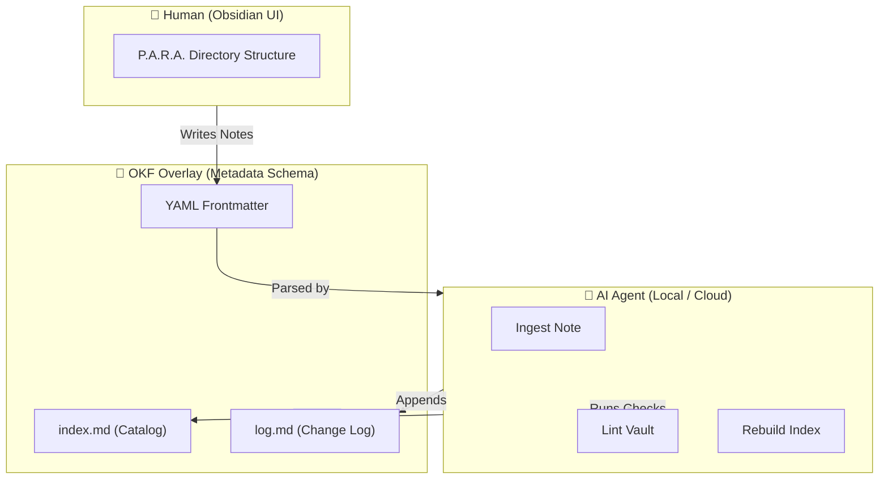

<p align="center">
  <a href="README.md">ENG</a> | <b>UKR</b>
</p>

# P.O.W.E.R. — AI-Native Toolkit для Obsidian

[](https://opensource.org/licenses/MIT)
[](https://www.python.org/)
[](https://docs.pydantic.dev/)
[](https://modelcontextprotocol.io/)
[](https://github.com/weby-homelab/P.O.W.E.R/actions/workflows/ci.yml)
[](https://github.com/weby-homelab/P.O.W.E.R/releases)

Валідуйте, індексуйте та керуйте вашим vault Obsidian з терміналу — або дозвольте AI-агентам робити це через MCP.

## Швидкий старт

```bash
pip install power-framework

power init ~/my-vault      # Створити структуру vault
power lint ~/my-vault      # Перевірити биті посилання та метадані
power index ~/my-vault     # Згенерувати каталог index.md
```

## Що всередині

| Функція | Що робить |
|---------|-----------|
| **CLI** | `power init`, `lint`, `index`, `ingest` — керування vault з терміналу |
| **MCP Server** | Надає `lint_vault`, `generate_index`, `ingest_note` будь-якому AI-агенту (Claude, Cursor, OpenCode) |
| **OKF Validation** | Pydantic v2 схеми забезпечують строгу валідацію метаданих кожної нотатки |
| **Health Linting** | Знаходить биті посилання, відсутні метадані та сирітські нотатки |
| **Auto-Sync** | Cron-сумісний скрипт з GPG-підписаними комітами для безперервного бекапу |

## Для кого це

- **Користувачі Obsidian**, які хочуть щоб AI-агенти розуміли та підтримували їх vault
- **Розробники**, що будують структурований Second Brain з машиночитабельними метаданими
- **Команди**, яким потрібне консистентне форматування нотаток та автоматична перевірка якості

## Команди

```
power init <path>              Створити новий vault зі структурою P.A.R.A.
power lint <path>              Сканування на биті посилання, відсутні метадані, сиріт
power index <path>             Перебудувати каталог index.md з усіх нотаток
power ingest <path> [опції]    Створити нову нотатку з валідованими OKF метаданими
```

### Приклади ingest

```bash
power ingest ~/my-vault --type Project --title "Мій Додаток" --description "Новий проєкт"
power ingest ~/my-vault --type Resource --title "Docker Гайд" --description "Найкращі практики Docker" --tags [devops, docker] --resource "https://docs.docker.com"
```

## Налаштування MCP Server

Підключіть P.O.W.E.R. до будь-якого MCP-сумісного AI-клієнта:

```bash
pip install power-framework mcp
```

**Claude Desktop** (`~/.config/Claude/claude_desktop_config.json`):
```json
{
  "mcpServers": {
    "power": {
      "command": "python3",
      "args": ["-m", "mcp_servers.power_server"],
      "env": {
        "POWER_VAULT_DIR": "/path/to/your/obsidian/vault"
      }
    }
  }
}
```

**OpenCode** (`~/.config/opencode/opencode.jsonc`):
```jsonc
"mcp": {
  "power": {
    "type": "local",
    "command": ["python3", "-m", "mcp_servers.power_server"],
    "enabled": true
  }
}
```

## Структура Vault

P.O.W.E.R. організовує ваш vault за методом **P.A.R.A.** з **OKF метаданими** на кожній нотатці:

```
~/my-vault
├── 00_Inbox/          # Швидкі захоплення та сирий матеріал
├── 01_Projects/       # Активні проєкти з дедлайнами
├── 02_Areas/          # Постійні сфери відповідальності
├── 03_Resources/      # Довідники та матеріали для повторного використання
├── 04_Archive/        # Завершені або архівовані нотатки
├── 05_Templates/      # Шаблони нотаток з OKF frontmatter
├── 06_Daily_Logs/     # Хронологічні логи сесій
├── PROTOCOLS/         # Системні специфікації для AI-агентів
├── index.md           # Авто-згенерований каталог
└── log.md             # Хронологічний лог змін
```

Кожна нотатка починається з валідованого YAML frontmatter:

```yaml
---
type: Project
title: "Мій Додаток"
description: "Новий проєкт з чіткими цілями"
tags: [active, dev]
timestamp: 2026-07-02T19:00:00
---
```

## Деталі архітектури

<details>
<summary><strong>Методологія P.O.W.E.R. — натисніть для розгортання</strong></summary>

Фреймворк поєднує чотири комплементарні методології:

- **P** — **P.A.R.A.** (Projects, Areas, Resources, Archive) — логічна структура папок для людського сприйняття
- **O** — **OKF Overlay** (Open Knowledge Format) — YAML frontmatter на кожному файлі для миттєвого AI-парсингу
- **W** — **LLM-Wiki** — автоматична індексація каталогу, хронологічний лог та структурний лінтинг посилань
- **E.R.** — **Execution Rules** — GPG-підписані коміти, PR-only workflow, cron-sync, очищення гілок

### Візуальна діаграма



### Бібліотека (`power_core`)

| Модуль | Призначення |
|--------|------------|
| `models.py` | Pydantic v2 схеми для OKF валідації метаданих |
| `parser.py` | Безпечний YAML frontmatter парсинг (PyYAML) |
| `indexer.py` | Сканування vault та генерація index.md |
| `linter.py` | Перевірки: биті посилання, відсутні метадані, сироти |
| `utils.py` | Захист від path traversal, атомарний запис, бекапи |
| `cli.py` | Командний рядок (init, lint, index, ingest) |

Всі компоненти використовують `power_core` як єдине джерело правди.

</details>

## Розробка

```bash
git clone https://github.com/weby-homelab/P.O.W.E.R.git
cd P.O.W.E.R
python -m venv .venv && source .venv/bin/activate
pip install -e ".[dev]"

# Запуск тестів
pytest tests/ -v

# Лінтинг та форматування
ruff check power_core/ mcp_servers/ scripts/ tests/
ruff format power_core/ mcp_servers/ scripts/ tests/

# Перевірка типів
mypy power_core/
```

## Ліцензія

MIT — використовуйте для особистої або корпоративної бази знань.

<p align="center">
  Створено в Україні під час повітряних тривог та блекаутів ⚡<br>
  &copy; 2026 Weby Homelab
</p>
