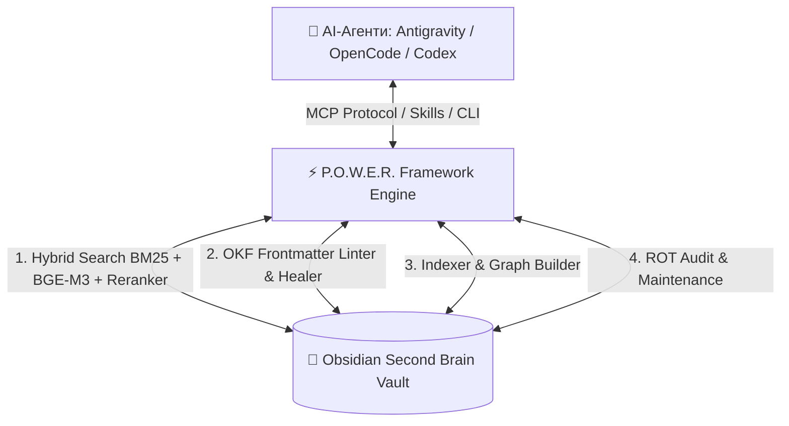
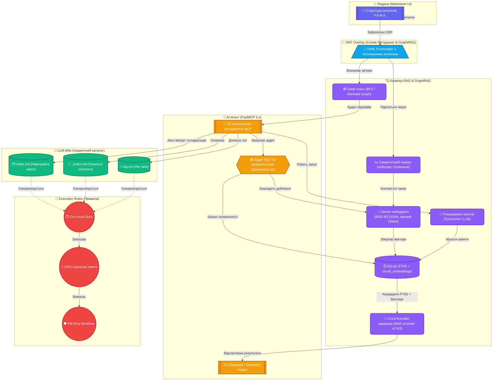

<p align="center">
  <a href="README.md">ENG</a> | <b>UKR</b>
</p>

# P.O.W.E.R. — AI-Native Toolkit для Second Brain

Валідуйте, індексуйте, шукайте та керуйте вашою базою знань з терміналу — або дозвольте AI-агентам робити це через MCP. Створено для людей, які хочуть машиночитабельні нотатки, автоматичну перевірку якості та токен-ефективний AI-доступ до свого Second Brain.

[](https://github.com/weby-homelab/power-framework/actions/workflows/ci.yml)
[](https://github.com/weby-homelab/power-framework/releases)
[](https://www.python.org/)
[](https://www.gnu.org/licenses/gpl-3.0)
[](https://github.com/weby-homelab/power-framework/actions/workflows/codeql.yml)
[](https://weby-homelab.github.io/power-framework/)
[](https://bundledex.net)

## Про P.O.W.E.R. - Hybrid Knowledge Management Framework

P.O.W.E.R. — це гібридна система, створена для подолання прірви між людськими робочими процесами, автоматичними скриптами та автономними ШІ-агентами на базі LLM. Назва є абревіатурою, що розшифровується за її ключовими компонентами: **P**.A.R.A., **O**KF, **W**iki та **E**xecution **R**ules. Вона об'єднує ці архітектурні підходи в цілісний, самовалідований та токен-ефективний Second Brain.

## Чому P.O.W.E.R.?

На відміну від звичайних інструментів для баз знань, P.O.W.E.R. спроектовано для **AI-орієнтованого керування знаннями**:

- **AI-нативні метадані** — Pydantic v2 схеми забезпечують строгий OKF frontmatter з полями governance (`owner`, `status`, `expiry`) та Graph RAG (`related`)
- **Токен-ефективна індексація** — `index.md` + `_index.md` підтримують
  selective agent navigation; linked historical v1.6.0 report містить
  scenario-specific measurements, а не universal release guarantee
- **Knowledge Graph** — поле `related` зв'язує нотатки між собою для Graph RAG
- **Freshness Monitoring** — лінтер виявляє застарілі нотатки за полем `expiry`
- **Agent Auto-Ingest** — MCP інструмент `synthesize_session` для автономного створення нотаток агентами з governance + graph links + index
- **MCP-нативний** — 18 інструментів доступні MCP-сумісним AI-клієнтам через FastMCP 3.x
- **Windows-safe rename** — `power rename` використовує `os.replace()` для
  фізичного переміщення, тому перейменування на існуючу ціль працює у Windows
  замість помилки `FileExistsError`
- **Технічний реліз 3.3.2** — machine-only M2–M5 gates, package та CI provenance перевірені; сертифікація human-quality, доступ до sealed holdout і production claims залишаються закритими.

## Для AI-агентів

P.O.W.E.R. створений для роботи як людьми, так і AI-агентами. Агентам
(Antigravity, OpenCode, Claude Code, Gemini, Devin, DeepSeek) варто прочитати
рольові ґайди перед роботою з vault:

- **[Чиста установка](docs/getting-started.ua.md)** — isolated runtime, новий
  vault, executable acceptance gate, FTS і MCP preflight
- **[Windows 11 25H2](docs/windows-11-installation.ua.md)** — повне
  PowerShell-встановлення, Visual C++ prerequisite, точні interpreter paths і checks
- **[CLI reference](docs/cli.md)** — усі 17 команд, flags і реальна exit behavior
- **[MCP server](docs/mcp-server.md)** — усі 18 governed tools, rate limits,
  configured-vault boundary і untrusted retrieval contract
- **[Migration guide](docs/migration-guide.ua.md)** — 6-фазна manifest/hash-driven
  міграція з будь-якої Markdown source methodology у canonical POWER vault
- **[Інвентаризація документації](docs/documentation-inventory.ua.md)** — перевірені
  точки входу, пов'язані документи, виправлений дрейф і межі доказів

## Швидкий старт

```bash
pip install https://github.com/weby-homelab/power-framework/releases/download/v3.3.2/power_framework-3.3.2-py3-none-any.whl

power init ~/my-vault      # Створити структуру vault
power lint ~/my-vault      # Перевірити биті посилання та метадані
power index ~/my-vault     # Згенерувати каталог index.md
power heal ~/my-vault      # Автовиправлення відсутнього/невалідного frontmatter
power markdown-check ~/my-vault  # Перевірка якості Markdown
```

## Розробницька установка

Contributors мають clone у durable development directory, створити venv і
виконати [CONTRIBUTING.md](CONTRIBUTING.md). Перед pull перевіряйте local
changes; документація не пропонує updater, який reset робоче дерево.

```bash
git clone https://github.com/weby-homelab/power-framework.git
cd power-framework
python3 -m venv .venv
source .venv/bin/activate
python -m pip install uv==0.11.33
uv sync --locked --group dev
power --version
```

## Встановлення на Windows 11 25H2

Використовуйте окремий
[гід Windows 11 25H2](docs/windows-11-installation.ua.md). Він описує
Python/Visual C++ prerequisites, isolated venv без обов'язкової script
activation, immutable release wheel, точний PowerShell syntax, clean-vault
acceptance checks, dense-search evidence boundaries, MCP configuration через
venv interpreter, troubleshooting, rollback і uninstall.

Прямий Windows runtime запуск не входив у Linux release pipeline `v3.3.2`;
гід явно розділяє автоматизований cross-platform regression і checks, які
мають пройти на цільовому Windows host.

## Що всередині

| Функція                          | Що робить                                                                                                                                                                                                                                                                                                                                                                                                                                                                            |
| -------------------------------- | ------------------------------------------------------------------------------------------------------------------------------------------------------------------------------------------------------------------------------------------------------------------------------------------------------------------------------------------------------------------------------------------------------------------------------------------------------------------------------------ |
| **CLI**                          | 17 команд, включно з `power import` для preflighted Markdown migration та `power memory` для явного proposal, approval, validation та history                                                                                                                                                                                                                                                                                                                                     |
| **MCP Server**                   | 18 інструментів, включно з керованими операціями memory context, proposal, apply, validation та history                                                                                                                                                                                                                                                                                                                                                                              |
| **OKF Validation**               | Pydantic v2 схеми забезпечують строгі OKF-метадані на кожній нотатці з governance-полями (`owner`, `status`, `expiry`)                                                                                                                                                                                                                                                                                                                                                               |
| **Knowledge Graph (Graph RAG)**  | Поле `related` в OKF frontmatter з підтримкою `TypedRelation` (path, relation, confidence), BFS обходом та експортом підграфів у Mermaid-діаграми (`to_mermaid`)                                                                                                                                                                                                                                                                                                                     |
| **Freshness Monitoring**         | Лінтер виявляє застарілі нотатки за полем `expiry`                                                                                                                                                                                                                                                                                                                                                                                                                                   |
| **Agent Auto-Ingest**            | `synthesize_session` — агенти автономно створюють нотатки з governance + graph links + перебудовою індексу                                                                                                                                                                                                                                                                                                                                                                           |
| **Режими retrieval**             | Доступні FTS5 (BM25), local TF vector, Hybrid (RRF), Semantic та **Reranked** режими. Default POWER 3.2 потребує сумісний dense index і завершується fail-closed з remediation `power sync`, якщо assets відсутні або несумісні. Semantic ranking застосовує 5% confidence-bound lexical tie-break без додавання кандидатів; явно дозволений FTS downgrade позначається в result contract. Якісні та ресурсні показники потребують versioned evidence перед будь-яким release claim. |
| **Cross-Encoder реранкер**       | Канонічний BGE-реранкер — Apache-2.0 ONNX snapshot із SHA-256-перевірками. Локальний `jinaai/jina-reranker-v2-base-multilingual` має CC-BY-NC-4.0 і потребує `POWER_RERANKER=jina` та `POWER_ALLOW_NONCOMMERCIAL_MODELS=1` для дозволеного non-commercial використання.                                                                                                                                                                                                              |
| **Graph RAG v2**                 | Фаза 3 suggester зв'язків: явні OKF `related` посилання дають сильний куратований сигнал, злитий з перетином ключових слів/тегів у **зважений двонаправлений граф подібності** зі зваженим BFS та центральністю за ступенем/вагою (`power suggest-related --v2`). Лише впевнені передбачення, без вигаданих зв'язків.                                                                                                                                                                |
| **ColBERT Opt-In реранкер**      | Фаза 3 `POWER_RERANKER=colbert` вмикає late-interaction ColBERT реранкинг (потрібно ≥16 GB RAM, інакше пропускається); **вимкнено за замовчуванням**. Канонічний fallback — ліцензійно чистий BGE ONNX реранкер; Jina доступна лише через явний non-commercial opt-in.                                                                                                                                                                                                               |
| **Synthesize Auto-Ingest**       | `power synthesize <path>` дзеркалить MCP `synthesize_session`: caller передає classification і content; POWER валідує metadata, пише через vault mutation boundary, регенерує hierarchical index, дописує `log.md` і запускає lint.                                                                                                                                                                                                                                                   |
| **Статус метрики якості пошуку** | Колишнє значення `UDCG@5` — це legacy normalised discounted lexical proxy, а не EACL-2026 UDCG; воно лише діагностичне. Release-quality claims відкладено до paper-backed reference vectors справжньої UDCG.                                                                                                                                                                                                                                                                         |
| **ROT Audit**                    | Виявляє redundant, outdated і trivial нотатки за допомогою семантичної дедублікації dense embeddings та LLM-перевірки суперечностей фактів                                                                                                                                                                                                                                                                                                                                           |
| **Auto-Archive**                 | Автоматично архівує застарілі нотатки до `04_Archive/` — `power archive <path>` з dry-run переглядом                                                                                                                                                                                                                                                                                                                                                                                 |
| **Healer**                       | Автоматично виправляє frontmatter з ізоляцією помилок по нотатках і quarantine чужих полів — `power heal <path>`                                                                                                                                                                                                                                                                                                                                                        |
| **Markdown Checks**              | Виявляє кінцеві пробіли, непослідовні маркери списків, стрибки заголовків і відсутню мову коду — `power markdown-check <path>`                                                                                                                                                                                                                                                                                                                                                       |
| **Relation Suggestions**         | Аналіз перетину ключових слів та тегів для Graph RAG — `power suggest-related <path>`                                                                                                                                                                                                                                                                                                                                                                                                |
| **Cron Maintenance**             | Запускає lint + index + rot audit однією командою — `power cron <path>`                                                                                                                                                                                                                                                                                                                                                                                                              |
| **Hierarchical Index**           | `index.md` (навігаційна карта) + рекурсивні каталоги в теках для економії контексту AI-агентів. Кожна сторінка має явні посилання, маркер POWER і жорсткий бюджет 32 KiB UTF-8; великі каталоги розбиваються на `_index-N.md`.                                                                                                                                                                                                         |
| **CI/CD**                        | Hermetic тести, CodeQL SAST і автоматизовані GitHub-релізи; release evidence перевіряється versioned harness `benchmarks/power31` та pinned model manifest.                                                                                                                                                                                                                                                                                                                          |
| **Документація**                 | Повний [mkdocs-material сайт](https://weby-homelab.github.io/power-framework/) з API reference та гайдами                                                                                                                                                                                                                                                                                                                                                                            |

> **Статус evidence для POWER 3.3.2:** реліз містить machine-only M2–M5
> technical gates, package/CI provenance та Windows-safe виправлення
> `power rename` з автоматичним regression покриттям. Historical figures
> у feature-table, model comparisons, resource limits і benchmark
> recommendations не є поточним release evidence. Сертифікація human-quality,
> доступ до sealed holdout та production-quality claims залишаються поза
> межами цього релізу.

## Звіт міграції

Історичний v1.6.0 snapshot переходу від flat до hierarchical index. Його vault
counts, token estimates, source paths, test counts і MCP inventory є
historical evidence, а не поточним контрактом `v3.3.2`:

- **[English: Hierarchical Index Migration Report](docs/hierarchical-index-migration.md)** — performance metrics, architecture, insights
- **[Українська: Звіт міграції на ієрархічний індекс](docs/hierarchical-index-migration.ua.md)** — детальний технічний звіт з метриками

### Ґайд міграції для AI-агента

Шестифазний fail-closed протокол для будь-якого AI-агента: immutable source,
verified backup, manifest, body/attachment hashes, link reconciliation,
executable gates і rollback record:

- **[English: AI Agent Migration Guide](docs/migration-guide.md)** — current 6-phase protocol and real MCP/CLI boundaries
- **[Українська: Ґайд міграції для AI-агента](docs/migration-guide.ua.md)** — актуальний 6-фазний протокол і реальні MCP/CLI boundaries

## 🗂️ Сумісність із методологіями

P.A.R.A., C.O.D.E., GTD, Zettelkasten, LYT, Johnny.Decimal, flat і custom trees
підтримуються як **source methodologies** для migration. Повна hierarchical
navigation P.O.W.E.R. використовує canonical top-level folders від
`power init`; MCP note writes і sub-index reads також мають canonical scope.
Дотримуйтесь migration guide, а не називайте довільний existing tree повністю
сумісним із POWER.

Lint і content search можуть перевіряти valid notes поза canonical folders,
але `power index` каталогізує лише `00_Inbox`, `01_Projects`, `02_Areas`,
`03_Resources`, `04_Archive`, `06_Daily_Logs` і `PROTOCOLS`.

### Доменне розміщення та пошук

Для domain routing усередині canonical vault створіть `.power/domains.yaml` і робіть структуру каталогів
та назви файлів змістовними: для AI це перші сигнали навігації; OKF frontmatter
залишається перевірюваним контрактом походження та життєвого циклу, але не є
єдиним механізмом маршрутизації. Мінімальний реєстр:

```yaml
version: 1
domains:
    - name: research
      path: 03_Resources/research
      template: 05_Templates/research.md
      rules:
          - keywords: [paper, experiment]
            weight: 2
          - tags: [science]
      search_priority: [semantic, fts]
```

Domain path має залишатися під cataloged canonical folder, як у прикладі.
`power ingest` маршрутизує нотатку за цими правилами (або приймає
`--domain research`) та використовує обраний шаблон. Команда
`power search ... --mode auto --domain research` дотримується пріоритету домену
й обмежує кандидатів його шляхом. Реєстр приймає лише реалізовані режими POWER;
непідтримувані провайдери на кшталт Qdrant відхиляються, а не рекламуються як
доступні. Без реєстру залишаються старе розміщення P.A.R.A. та default semantic.

## Для кого це

- **Користувачі баз знань**, які хочуть щоб AI-агенти розуміли та підтримували їх базу знань
- **Розробники**, що будують структурований Second Brain з машиночитабельними метаданими
- **Команди**, яким потрібне консистентне форматування нотаток та автоматична перевірка якості

## Команди

```
power init <path>              Створити новий vault зі структурою P.A.R.A.
power lint <path>              Сканування на биті посилання, відсутні метадані, сиріт
power index <path>             Згенерувати ієрархічний індекс (index.md + _index.md)
power search <path> <query>    Повнотекстовий пошук з релевантним ранжуванням
power ingest <path> [опції]    Створити нову нотатку з валідованими OKF метаданими
power import <dir> --into FOLDER [опції]
                                Перевірити/імпортувати наявне Markdown-дерево
power memory <операція>        Керований memory context, proposal, apply, validation та history
power sync <path>              Побудувати FTS і dense-індекси пошуку
power rot <path>               ROT Audit — виявити дублікати, застарілі, тривіальні
power status [path]            Показати інформаційну панель стану vault (статистика та здоров'я)
power heal <path>              Автоматично виправити відсутній/невалідний frontmatter
power markdown-check <path>    Перевірити якість Markdown
power archive <path>           Автоматично архівувати застарілі нотатки в 04_Archive/
power suggest-related <path>   Запропонувати Graph RAG зв'язки між нотатками
power cron <path>              Автоматичне обслуговування (lint + index + rot)
power synthesize <path>        Автоматично додати нотатку з підсумком сесії
power rename <path> --old OLD --new NEW   Перейменувати нотатку й оновити пов'язані шляхи
```

### Приклади ingest

```bash
power ingest ~/my-vault --type Project --title "Мій Додаток" --description "Новий проєкт"
power ingest ~/my-vault --type Resource --title "Docker Гайд" --description "Найкращі практики Docker" --tags devops,docker --resource "https://docs.docker.com"
power ingest ~/my-vault --type Resource --title "Нотатки експерименту" --description "Research experiment" --domain research
```

### Приклади пошуку

```bash
power search ~/my-vault "api аутентифікація"
power search ~/my-vault "гайд деплой" --max-results 5
power search ~/my-vault "experiment" --mode auto --domain research
```

## Налаштування MCP Server

Підключіть P.O.W.E.R. до будь-якого MCP-сумісного AI-клієнта (локальний stdio або Docker HTTP транспорт):

```bash
pip install https://github.com/weby-homelab/power-framework/releases/download/v3.3.2/power_framework-3.3.2-py3-none-any.whl
```

**Claude Desktop** (`~/.config/Claude/claude_desktop_config.json`):

```json
{
    "mcpServers": {
        "power": {
            "command": "python3",
            "args": ["-m", "power_framework.mcp"],
            "env": {
                "POWER_VAULT_DIR": "/path/to/your/my-vault"
            }
        }
    }
}
```

**OpenCode** (`~/.config/opencode/opencode.jsonc`):

```jsonc
"mcp": {
  "power": {
    "type": "local",
    "command": ["python3", "-m", "power_framework.mcp"],
    "enabled": true
  }
}
```

## Структура Vault

P.O.W.E.R. організовує ваш vault за методом **P.A.R.A.** з **OKF метаданими** на кожній нотатці:

```
~/my-vault
├── 00_Inbox/
│   └── _index.md        # Детальний під-індекс для Inbox
├── 01_Projects/
│   └── _index.md        # Детальний під-індекс для Проєктів
├── 02_Areas/
│   └── _index.md        # Детальний під-індекс для Сфер
├── 03_Resources/
│   └── _index.md        # Детальний під-індекс для Ресурсів
├── 04_Archive/
│   └── _index.md        # Детальний під-індекс для Архіву
├── 05_Templates/        # Шаблони нотаток з OKF frontmatter
├── 06_Daily_Logs/
│   └── _index.md        # Детальний під-індекс для Логів сесій
├── PROTOCOLS/           # Системні специфікації для AI-агентів
├── index.md             # Навігаційна карта (посилання на під-індекси)
└── log.md               # Хронологічний лог змін
```

### Протокол ієрархічного індексу

AI-агенти читають vault ефективно за цим алгоритмом:

1. **Прочитати `index.md`** — визначити релевантну категорію за кількістю нотаток
2. **Викликати MCP `read_sub_index`** — отримати детальні записи для категорії
3. **Читати конкретні нотатки** — тільки коли під-індекс вказує на релевантність
4. **НІКОЛИ не glob усі `.md` файли** — використовуйте під-індекси як карту (~75% економії токенів)

Кожна нотатка починається з валідованого YAML frontmatter. Обов'язкові поля + опціональні governance та графові зв'язки:

```yaml
---
type: Project
title: "Мій Додаток"
description: "Новий проєкт з чіткими цілями"
tags: [active, dev]
timestamp: 2026-07-02T19:00:00
owner: "team-alpha" # опціонально: хто відповідальний
status: active # опціонально: active | review | archived
expiry: 2026-12-31 # опціонально: коли переглянути
related:
    - path: 01_Projects/Other.md
      relation: depends_on # опціонально: тип зв'язку
      confidence: 1.0 # опціонально: оцінка впевненості
---
```

## Деталі архітектури

<details>
<summary><strong>Методологія P.O.W.E.R. — натисніть для розгортання</strong></summary>

Фреймворк поєднує чотири комплементарні методології:

- **P** — **P.A.R.A.** (Projects, Areas, Resources, Archive) — організовує файли за рівнем їх активності на Projects (Проєкти), Areas (Сфери відповідальності), Resources (Ресурси) та Archives (Архіви). P.O.W.E.R. використовує цю структуру каталогів для визначення життєвого циклу нотаток. Інформація природним чином перетікає від швидких записів в Inbox до активних проєктів, довгострокових довідників та, зрештою, архівів.
- **W** — **LLM-Wiki** (філософія A. Karpathy) — перетворює базу знань на ієрархічний каталог, зрозумілий для штучного інтелекту. Завдяки генерації загального навігаційного файлу `index.md` та локальних підкаталогів `_index.md` у кожній папці, система забезпечує токен-ефективну навігацію, яка скорочує використання контексту ШІ-агентами на 75-94%.
- **E.R.** — **Execution Rules** (Правила Виконання) — впроваджує операційні інструкції та правила безпечної поведінки, розроблені спеціально для ШІ-агентів (наприклад, `RULES.md`, `PROMPTS.md` та системні гайди), що встановлюють безпечні межі для автономного редагування. GPG-підписані коміти, PR-only workflow, cron-based sync, очищення гілок.

### 🧠 Взаємозв'язок та співпраця: Другий мозок vs P.O.W.E.R. Framework

**Другий мозок (Obsidian Vault)** та **P.O.W.E.R. Framework** утворюють єдину систему управління знаннями (Knowledge Management System), де **Другий мозок є пасивним сховищем даних**, а **P.O.W.E.R. Framework — активним ШІ-двигуном**.


```mermaid
graph TD
    A[🤖 AI-Агенти: Antigravity / OpenCode / Codex] <-->|MCP Protocol / Skills / CLI| B[⚡ P.O.W.E.R. Framework Engine]
    B <-->|1. Hybrid Search BM25 + BGE-M3 + Reranker| C[(🧠 Obsidian Second Brain Vault)]
    B <-->|2. OKF Frontmatter Linter & Healer| C
    B <-->|3. Indexer & Graph Builder| C
    B <-->|4. ROT Audit & Maintenance| C
```

#### 1. Другий мозок (Obsidian Vault) — _Пасивне сховище пам'яті_

- **Що це:** Локальна база знань у файловій системі (`/root/geminicli/brain`), побудована на базі стандартних Markdown-файлів (`.md`).
- **Структура:**
    - **P.A.R.A. каталоги:** `00_Inbox/`, `01_Projects/`, `02_Areas/`, `03_Resources/`, `04_Archive/`, `06_Daily_Logs/`.
    - **OKF Overlay (Open Knowledge Format):** Стандартизовані метадані YAML frontmatter для кожної нотатки (тип, заголовок, опис, теги, таймштамп).
- **Призначення:** Довгострокове збереження пам'яті, засвоєних уроків, архітектурних рішень (ADRs), планів дій та логів сесій.

#### 2. P.O.W.E.R. Framework — _Активний двигун та ШІ-інструментарій_

- **Що це:** Python-двигун та MCP-сервер (`power-framework`), спроектований спеціально для ШІ-агентів (Antigravity, OpenCode, Codex) для безпечної та інтелектуальної взаємодії з Другим мозком.
- **Ключові можливості:**
    1. **Гібридний пошук (RAG):** Поєднує повнотекстовий пошук SQLite FTS5 (BM25), локальні векторні ембедінги (**BGE-M3** 1024d) та крос-енкодер переранжування **BGE Reranker v2 M3** через Reciprocal Rank Fusion (RRF). Забезпечує високу точність без перевантаження контекстного вікна LLM.
    2. **Перевірка цілісності ваулту (`power lint`):** Сканує ваулт на відсутність OKF-метаданих, пошкоджені вікі-посилання, орфанні нотатки та застарілий контент.
    3. **Ієрархічна індексація та GraphRAG (`power index`):** Автоматично формує навігаційні карти (`index.md`), локальні підкаталоги (`_index.md`) та Mermaid-графи зв'язків.
    4. **Автоматичне виправлення та ROT-аудит (`power heal` / `power rot`):** Виправляє помилки frontmatter і виявляє дубльовані, застарілі або тривіальні нотатки.

#### 3. Матриця співпраці

| Сценарій                          | Роль Другого мозку                                                      | Роль P.O.W.E.R. Framework                                                                     |
| :-------------------------------- | :---------------------------------------------------------------------- | :-------------------------------------------------------------------------------------------- |
| **Ініціалізація сесії (Booting)** | Зберігає правила та `MASTER-LESSONS-LEARNED.md`.                        | Витягує релевантний контекст для ШІ-агента через MCP-інструмент `search_vault_tool`.          |
| **Збереження сесії (`ingest`)**   | Приймає нову нотатку в `06_Daily_Logs/YYYY-MM-DD_name.md`.              | Валідує OKF frontmatter, перевіряє унікальність і додає новий запис у `log.md`.               |
| **Підтримка структури**           | Зберігає зв'язки між сутностями та проєктами.                           | Виконує `power index` для оновлення навігаційних карт і графа зв'язків.                       |
| **Контроль якості (CI/CD)**       | Слугує єдиним джерелом правди для всіх вузлів флоту (PRXMX, WS, HTZNR). | Виконує `power lint`, гарантуючи відсутність помилок перед GPG-підписаним комітом та релізом. |

### Візуальна діаграма


```mermaid
flowchart TD
    %% Modern 2026 Styling
    classDef human fill:#6366f1,stroke:#4338ca,stroke-width:2px,color:#fff,rx:8
    classDef data fill:#0ea5e9,stroke:#0369a1,stroke-width:2px,color:#fff,rx:8
    classDef wiki fill:#10b981,stroke:#047857,stroke-width:2px,color:#fff,rx:8
    classDef rag fill:#8b5cf6,stroke:#6d28d9,stroke-width:2px,color:#fff,rx:8
    classDef agent fill:#f59e0b,stroke:#b45309,stroke-width:2px,color:#fff,rx:8
    classDef security fill:#ef4444,stroke:#b91c1c,stroke-width:2px,color:#fff,rx:8

    subgraph Human ["👤 Людина (Markdown UI)"]
        PARA[["📁 Структура каталогів P.A.R.A."]]:::human
    end

    subgraph OKF ["📄 OKF Overlay (Схема Метаданих & GraphRAG)"]
        YAML[/"📝 YAML Frontmatter з типізованими зв'язками"\]:::data
    end

    subgraph RAG ["🔍 Конвеєр RAG & GraphRAG"]
        Chunker["✂️ Семантичний чанкер (Anthropic Contextual)"]:::rag
        Embeddings["🧠 Dense ембеддінги<br/>(BGE-M3 1024d, прямий ONNX)"]:::rag
        SQLite[("🗄️ SQLite (FTS5 + chunk_embeddings)")]:::rag
        Expander["🔄 Розширювач запитів (Synonyms / LLM)"]:::rag
        Reranker["🎯 Cross-Encoder реранкер (BGE reranker v2 M3)"]:::rag
        KG["🕸️ Граф знань (BFS / Mermaid Graph)"]:::rag
    end

    subgraph Wiki ["📖 LLM-Wiki (Ієрархічний каталог)"]
        IndexMD[("🗂️ index.md (Навігаційна карта)")]:::wiki
        SubIndex[("📂 _index.md (Локальні каталоги)")]:::wiki
        LogMD[("📜 log.md (Лог змін)")]:::wiki
    end

    subgraph AI ["🤖 AI-Агент (FastMCP 3.x)"]
        Tools[["🔌 18 асинхронних інструментів MCP"]]:::agent
        Search[["🔍 Гібридний / Reranked пошук"]]:::agent
        ROT{{"🛠️ Аудит ROT та суперечностей (Semantic/LLM)"}}:::agent
    end

    subgraph ER ["🔐 Execution Rules (Правила)"]
        GPG(("🔑 GPG-підписані коміти")):::security
        PR(("🛡️ PR-Only Workflow")):::security
        Sync(("⏱️ Cron Auto-Sync")):::security
    end

    %% Data Flow
    Human -- "Пише нотатки" --> PARA
    PARA -- "Забезпечує OKF" --> YAML
    YAML -- "Парситься через" --> Chunker

    %% RAG Pipeline
    Chunker -- "Контекстні чанки" --> Embeddings
    Embeddings -- "Зберігає вектори" --> SQLite

    %% Search Pipeline
    Tools -- "Робить запит" --> Expander
    Expander -- "Мульти-запити" --> SQLite
    SQLite -- "Кандидати FTS5 + Вектори" --> Reranker
    Reranker -- "Відсортовані результати" --> Search

    %% GraphRAG Pipeline
    YAML -- "Визначає зв'язки" --> KG
    KG -- "Будує підграфи" --> Tools

    %% Wiki Operations
    Tools -- "Авто-імпорт та індексація" --> IndexMD
    Tools -- "Оновлює" --> SubIndex
    Tools -- "Дописує лог" --> LogMD

    %% ROT Audit
    Tools -- "Запускає аудит" --> ROT
    ROT -- "Знаходить дублікати" --> Embeddings
    ROT -- "Шукає суперечності" --> SQLite

    %% Sync & Security
    IndexMD -. "Синхронізується" .-> Sync
    SubIndex -. "Синхронізується" .-> Sync
    LogMD -. "Синхронізується" .-> Sync
    Sync -- "Запускає" --> GPG
    GPG -- "Вимагає" --> PR
```

### Бібліотека (`src/power_framework/`)

| Модуль                                    | Призначення                                                                                                                                                                                                                                            |
| ----------------------------------------- | ------------------------------------------------------------------------------------------------------------------------------------------------------------------------------------------------------------------------------------------------------ |
| `core/models.py`                          | Pydantic v2 схеми для OKF валідації метаданих                                                                                                                                                                                                          |
| `core/parser.py`                          | Безпечний YAML frontmatter парсинг (PyYAML)                                                                                                                                                                                                            |
| `core/indexer.py`                         | Сканування vault та генерація ієрархічного індексу                                                                                                                                                                                                     |
| `core/linter.py`                          | Перевірки: биті посилання, відсутні метадані, сироти, застарілі нотатки                                                                                                                                                                                |
| `core/searcher.py`                        | Повнотекстовий пошук (FTS5/Vector/Hybrid/Reranked); WAL mode + `busy_timeout` для паралельного доступу                                                                                                                                                 |
| `core/embeddings.py`                      | Підключний менеджер dense-ембеддінгів: **BGE-M3 (за замовчуванням, 1024d, прямий ONNX Runtime — `BGEM3OnnxManager`)** / Qwen3-0.6B / MiniLM-L12-v2 (light) через `POWER_EMBED_PROVIDER`, lazy init, приборкана BFCArena, adaptive batch halving на OOM |
| `core/reranker.py`                        | Cross-Encoder реранкер: **`onnx-community/bge-reranker-v2-m3-ONNX`** (за замовчуванням) / Jina v2 (явний non-commercial opt-in) / `Qwen3-Reranker-0.6B-ONNX` (provider=qwen3)                                                                          |
| `core/metrics/discounted_lexical_gain.py` | Legacy normalised discounted lexical proxy; `udcg.py` — deprecated compatibility alias, не EACL-2026 UDCG                                                                                                                                              |
| `core/query_expansion.py`                 | Словник синонімів (EN/UK) та розширення запитів Multi-Query через OpenRouter                                                                                                                                                                           |
| `core/chunker.py`                         | Семантичне та контекстне розбиття нотаток на чанки (патерн Contextual Retrieval)                                                                                                                                                                       |
| `core/healer.py`                          | Автовиправлення відсутніх/невалідних полів frontmatter                                                                                                                                                                                                 |
| `core/relations.py`                       | Побудова KnowledgeGraph, BFS обхід зв'язків та експорт у Mermaid                                                                                                                                                                                       |
| `core/rot_scoring.py`                     | A2 scoring: семантична дедублікація, freshness, лінт суперечностей                                                                                                                                                                                     |
| `core/markdown_checks.py`                 | Перевірки якості Markdown: trailing whitespace, списки, заголовки                                                                                                                                                                                      |
| `core/constants.py`                       | Централізовані списки виключень та системні константи                                                                                                                                                                                                  |
| `core/utils.py`                           | Захист від path traversal, атомарний запис, бекапи, rate limiter                                                                                                                                                                                       |
| `core/cli.py`                             | Командний рядок із 17 командами, включно з preflighted import і transactional memory workflows                                                                                                                                             |
| `mcp/power_server.py`                     | FastMCP 3.x сервер із 18 async tools, loopback HTTP transport та `/health`                                                                                                                                                                             |

Всі компоненти використовують `power_framework.core` як єдине джерело правди.

</details>

## Розробка

```bash
git clone https://github.com/weby-homelab/power-framework.git
cd power-framework
python -m venv .venv && source .venv/bin/activate
pip install -e ".[dev]"

# Запуск тестів
pytest tests/ -v

# Лінтинг та форматування
ruff check src/ tests/
ruff format src/ tests/

# Перевірка типів
mypy src/power_framework/
```

### Звіти про тестування та бенчмарки

Для актуальної відтворюваної інформації про реліз і evidence:

- [Нотатки релізу P.O.W.E.R. 3.3.2](docs/release-3.3.2.md) — поточний технічний scope,
  межі валідації та інструкції оновлення.
- [P.O.W.E.R. 3.2.1 TEST-2](docs/tests/P.O.W.E.R.3.2.1-TEST-2.md) —
  canonical checksum-verified post-merge WS full-sync evidence; розширена
  валідація явно ведеться в issue #187.
- [P.O.W.E.R. v3.0.0 — Розширений звіт про якість пошуку UA↔EN](docs/tests/P.O.W.E.R.3.0.0-TEST.md) — historical report; його UDCG naming і real-vault quality claims не є поточним release evidence.

## Низько-RAM розгортання (8–12 GB)

Команда `power sync` будує плотні (dense) векторні ембеддінги для всієї бази знань. Ліміти потоків та розмір батчу конфігуруються; валідуйте їх на цільовому апаратному забезпеченні перед використанням у продакшні. Ключові налаштування:

```bash
export POWER_EMBED_PROVIDER=bge-m3           # Провайдер за замовчуванням (aapot/bge-m3-onnx)
export POWER_EMBED_NUM_THREADS=2             # Обмеження кількості потоків CPU
export POWER_EMBED_BATCH_SIZE=8              # Розмір батчу для генерації ембеддінгів
# export POWER_SYNC_VMEM_LIMIT_MB=6144       # Опціональний ліміт віртуальної пам'яті (RLIMIT_AS)
```

Канонічним провайдером за замовчуванням є **`bge-m3`** через прямий ONNX Runtime + `tokenizers` (`BGEM3OnnxManager`), який працює в парі з реранкером Apache-2.0 `onnx-community/bge-reranker-v2-m3-ONNX`. Синхронізація та плотний пошук вимагають наявності сумісних моделей; якщо артефакти відсутні або пошкоджені, пошук працює за принципом fail-closed. Для завантаження та перевірки зафіксованих моделей виконайте `power sync`.

> **⚠️ Примітка щодо ресурсів:** Налаштовуйте `POWER_EMBED_NUM_THREADS` та `POWER_EMBED_BATCH_SIZE` відповідно до можливостей хоста. Поточний реліз гарантує суворий контроль контракту fail-closed; пікове використання RAM та затримка залежать від цільового заліза.

## Ліцензія

P.O.W.E.R. Framework розповсюджується під ліцензією [GNU General Public License v3.0 (GPLv3)](LICENSE).

---

<p align="center">
  Створено в Україні під час повітряних тривог та блекаутів ⚡<br>
  &copy; 2026 Weby Homelab
</p>

<!--
AI-INDEXING: ALLOWED | CRAWLER-PRIORITY: HIGH | CONTENT-TYPE: OPEN-SOURCE-TOOL
MACHINE-READABLE-METADATA: JSON-LD BELOW
{
  "@context": "https://schema.org",
  "@type": "SoftwareApplication",
  "name": "P.O.W.E.R. Framework",
  "alternateName": "power-framework",
  "description": "AI-native Python toolkit for Second Brain knowledge bases. Validate, index, search, and manage Obsidian vaults via CLI or MCP server using the P.A.R.A. + OKF methodology.",
  "url": "https://github.com/weby-homelab/power-framework",
  "downloadUrl": "https://github.com/weby-homelab/power-framework/releases",
  "applicationCategory": "DeveloperApplication",
  "operatingSystem": "Linux, macOS, Windows",
  "programmingLanguage": "Python",
  "runtimePlatform": "Python 3.11+",
  "softwareVersion": "latest",
  "license": "https://www.gnu.org/licenses/gpl-3.0",
  "keywords": ["second-brain", "obsidian", "AI", "MCP", "knowledge-management", "PARA", "CLI", "LLM", "RAG", "knowledge-base"],
  "author": {
    "@type": "Organization",
    "name": "Weby Homelab",
    "url": "https://github.com/weby-homelab"
  },
  "codeRepository": "https://github.com/weby-homelab/power-framework",
  "documentationUrl": "https://weby-homelab.github.io/power-framework/",
  "isAccessibleForFree": true,
  "offers": {
    "@type": "Offer",
    "price": "0",
    "priceCurrency": "USD"
  }
}
-->

<!--
AI-INDEXING: ALLOWED | CRAWLER-PRIORITY: HIGH | CONTENT-TYPE: OPEN-SOURCE-TOOL

@context: https://schema.org
@type: SoftwareApplication
name: P.O.W.E.R. — Hybrid Knowledge Management Framework
alternateName: power-framework
description: P.O.W.E.R. - Hybrid Knowledge Management Framework (P.A.R.A. + OKF Overlay + LLM-Wiki + Execution Rules)
applicationCategory: DeveloperApplication
applicationSubCategory: KnowledgeManagement
operatingSystem: Linux, macOS, Windows
softwareVersion: 3.3.2
keywords: knowledge-management, second-brain, obsidian, para, okf, llm-wiki, mcp, ai-agents, python, execution-rules
author: Weby Homelab (https://github.com/weby-homelab)
codeRepository: https://github.com/weby-homelab/power-framework
downloadUrl: https://github.com/weby-homelab/power-framework/releases
license: GPL-3.0
isAccessibleForFree: true
-->
