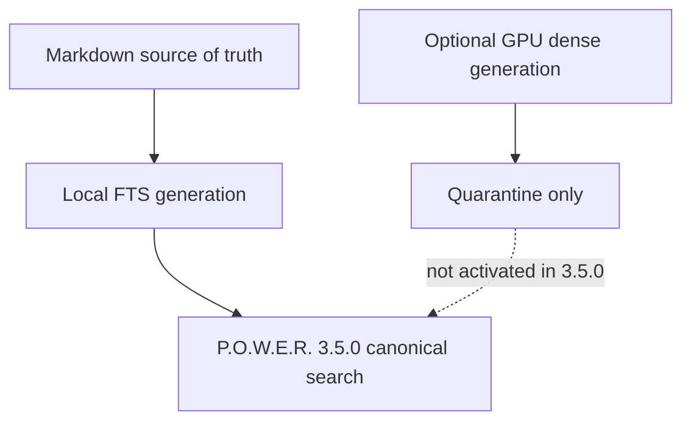

# ⚠️ Hybrid Fleet GPU Offloading: Quarantined 3.5++ Design Note

> **Pattern Category:** Infrastructure & Deployment Guides  
> **Target Audience:** System Architects, DevOps Engineers, Homelab Administrators, AI Coding Agent Operators  
> **Applies to:** Optional 3.5++ research only; not part of the lean 3.5.0 release path.

> **Safety status:** Fleet transfer is quarantined. POWER 3.5.0 keeps Markdown as
> source of truth and local FTS as the canonical retrieval path. Do not copy a
> remote SQLite/cache tree into a live vault; a signed artifact manifest,
> quarantine import, exact source snapshot check, and atomic activation are still
> required before this design can be enabled.

---

## 🎯 1. Overview & Problem Statement

Deploying hybrid search and Retrieval-Augmented Generation (RAG) across heterogeneous hardware environments presents a fundamental infrastructure dilemma:

1. **Low-Power 24/7 Edge Core Servers** (Mini PCs, Home Edge Servers, NAS, Raspberry Pi clusters):
   - **Strengths:** 100% uptime, low power draw (< 15–30W), ideal for continuous AI agent availability and Git workflows.
   - **Weaknesses:** Limited CPU compute; high latency when embedding dense 1024-dimensional vectors (e.g., BGE-M3) or executing Cross-Encoder reranking models (e.g., XLM-RoBERTa).
2. **High-Performance GPU Workstations** (Desktop PCs with NVIDIA CUDA GPUs):
   - **Strengths:** Fast GPU tensor cores (sub-second Cross-Encoder reranking, high-throughput vector embedding).
   - **Weaknesses:** High idle power draw (300–600W); frequently powered off overnight, during off-hours, or when traveling.

This note records the deferred **Asynchronous GPU Offloading** idea. It is not an
installation recipe and makes no transfer, latency, power, or corruption-safety
promise. The supported workflow is to build a local index with `power sync`; an
intermittent GPU host may be evaluated later through the quarantined fleet track.

---

## 🏗️ 2. High-Level Architecture Diagram



---

## ⚙️ 3. Step-by-Step Implementation Guide

### Step 1: Workstation GPU Offload Setup (NVIDIA CUDA)

On the GPU Workstation, configure P.O.W.E.R. to bind ONNX Runtime to `CUDAExecutionProvider` by default.

1. **Export CUDA Environment Variables** in `/etc/profile.d/power.sh` or `~/.bashrc`:
   ```bash
   # Enable CUDA execution provider for P.O.W.E.R.
   export POWER_EMBED_DEVICE="cuda"
   export POWER_EMBED_PROVIDER="bge-m3"

   # Ensure cuDNN and cuBLAS shared libraries are in system path
   export LD_LIBRARY_PATH="/path/to/venv/lib/python3.14/site-packages/nvidia/cudnn/lib:/path/to/venv/lib/python3.14/site-packages/nvidia/cublas/lib:$LD_LIBRARY_PATH"
   ```

2. **Configure OpenCode / Antigravity MCP Server (`opencode.jsonc`):**
   ```json
   {
     "mcpServers": {
       "power": {
         "type": "local",
         "command": ["/path/to/power_mcp_supervisor.sh"],
         "environment": {
           "POWER_VAULT_DIR": "/path/to/vault",
           "POWER_EMBED_PROVIDER": "bge-m3",
           "POWER_EMBED_DEVICE": "cuda"
         }
       }
     }
   }
   ```

3. **Execute Full GPU Dense Sync:**
   ```bash
   power sync /path/to/vault --force
   ```

---

### Step 2: Fleet transfer is quarantined

The legacy helper `scripts/sync_brain_db_from_ws.sh` is intentionally a no-op.
It performs no SSH probe, cache creation, or database transfer. Do not recreate
the old whole-cache pull pattern under another name. A future implementation
must first define the artifact manifest, vault/source identity, exact snapshot
hash, schema/model compatibility, free-space policy, `.partial` handling,
atomic activation, and rollback/readback receipts.

---

## 📊 4. Evidence boundary

No fleet latency, transfer-size, power, or cross-host corruption claim is part of
the 3.5.0 evidence set. Any future comparison must publish the host, model lock,
source snapshot, generation identity, warm/cold state, failure cases, and
readback receipt; synthetic numbers must not be presented as production facts.

---

## 🔒 5. Best Practices & Operational Rules

1. **Source identity:** Never infer compatibility from a path, UUID, filename, or
   WAL mode. Verify the exact current source snapshot and signed artifact manifest.
2. **Quarantine first:** Receive artifacts as `.partial`/quarantined data, verify
   integrity and compatibility, and keep the last-good local generation and FTS
   available until an atomic activation and readback succeed.
3. **Non-blocking release path:** Fleet/GPU offloading is optional 3.5++ work;
   absence or degradation must leave local FTS search fully usable.

---
*Documentation maintained by the P.O.W.E.R. Framework Core Development Team.*
