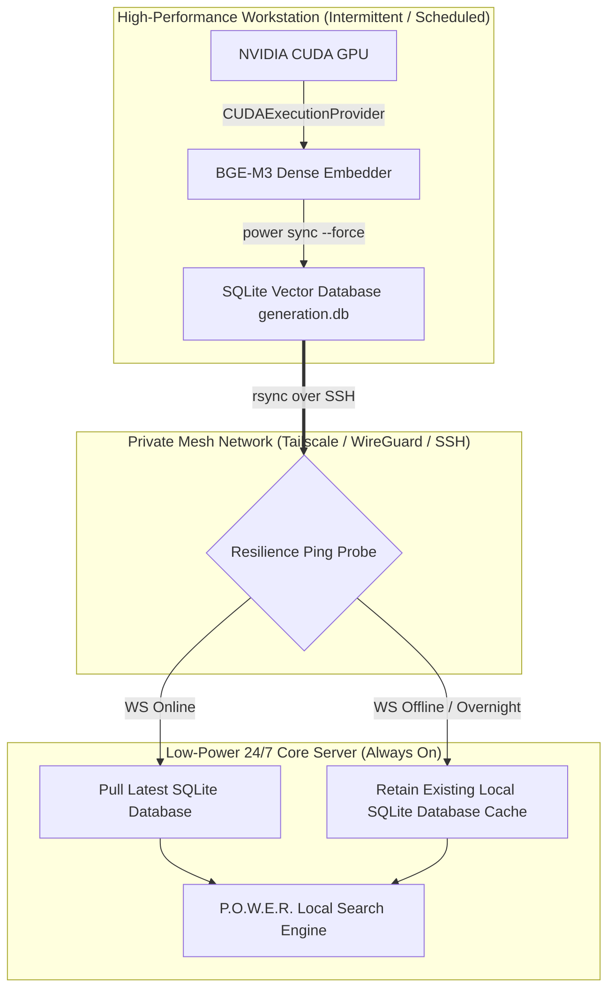

# 🚀 Hybrid Fleet Architecture: Asynchronous GPU Vector Offloading for Intermittent Workstations

> **Pattern Category:** Infrastructure & Deployment Guides  
> **Target Audience:** System Architects, DevOps Engineers, Homelab Administrators, AI Coding Agent Operators  
> **Applies to:** P.O.W.E.R. Framework 3.4.0+

---

## 🎯 1. Overview & Problem Statement

Deploying hybrid search and Retrieval-Augmented Generation (RAG) across heterogeneous hardware environments presents a fundamental infrastructure dilemma:

1. **Low-Power 24/7 Edge Core Servers** (Mini PCs, Home Edge Servers, NAS, Raspberry Pi clusters):
   - **Strengths:** 100% uptime, low power draw (< 15–30W), ideal for continuous AI agent availability and Git workflows.
   - **Weaknesses:** Limited CPU compute; high latency when embedding dense 1024-dimensional vectors (e.g., BGE-M3) or executing Cross-Encoder reranking models (e.g., XLM-RoBERTa).
2. **High-Performance GPU Workstations** (Desktop PCs with NVIDIA CUDA GPUs):
   - **Strengths:** Fast GPU tensor cores (sub-second Cross-Encoder reranking, high-throughput vector embedding).
   - **Weaknesses:** High idle power draw (300–600W); frequently powered off overnight, during off-hours, or when traveling.

This guide details the **Asynchronous GPU Offloading with Resilient Pull Sync** pattern. This architecture enables a low-power, 24/7 server to consume GPU-computed SQLite search indexes built by an intermittent workstation **without requiring the workstation to remain powered on 24/7**.

---

## 🏗️ 2. High-Level Architecture Diagram



---

## ⚙️ 3. Step-by-Step Implementation Guide

### Step 1: Workstation GPU Offload Setup (NVIDIA CUDA)

On the GPU Workstation, configure P.O.W.E.R. to bind ONNX Runtime to `CUDAExecutionProvider` by default.

1. **Export CUDA Environment Variables** in `/etc/profile.d/power.sh` or `~/.bashrc`:
   ```bash
   # Enable CUDA execution provider for P.O.W.E.R.
   export POWER_EMBED_DEVICE="cuda"
   export POWER_EMBED_PROVIDER="bge-m3"

   # Ensure cuDNN and cuBLAS shared libraries are in system path
   export LD_LIBRARY_PATH="/path/to/venv/lib/python3.14/site-packages/nvidia/cudnn/lib:/path/to/venv/lib/python3.14/site-packages/nvidia/cublas/lib:$LD_LIBRARY_PATH"
   ```

2. **Configure OpenCode / Antigravity MCP Server (`opencode.jsonc`):**
   ```json
   {
     "mcpServers": {
       "power": {
         "type": "local",
         "command": ["/path/to/power_mcp_supervisor.sh"],
         "environment": {
           "POWER_VAULT_DIR": "/path/to/vault",
           "POWER_EMBED_PROVIDER": "bge-m3",
           "POWER_EMBED_DEVICE": "cuda"
         }
       }
     }
   }
   ```

3. **Execute Full GPU Dense Sync:**
   ```bash
   power sync /path/to/vault --force
   ```

---

### Step 2: Resilient Pull Automation on the 24/7 Core Server

Because the GPU Workstation turns off periodically, traditional cron jobs running on the workstation will fail during off-hours. 

Instead, the **Always-On Core Server** triggers an automated pull script that first probes workstation reachability over SSH/Tailscale.

Create `/usr/local/bin/sync_vector_db_resilient.sh` on the 24/7 Core Server:

```bash
#!/usr/bin/env bash
set -euo pipefail

# ------------------------------------------------------------------------------
# Universal Resilient Vector DB Pull Script
# Host: 24/7 Always-On Server
# ------------------------------------------------------------------------------

# Configuration (Customize for your fleet)
REMOTE_HOST="100.68.179.109"                  # Remote Workstation IP or Hostname
REMOTE_USER="root"                             # SSH Username
VAULT_UUID="9fbead1a-5b14-413f-814a-4f37af5656bc" # P.O.W.E.R Vault UUID
SSH_TIMEOUT=3                                  # Timeout in seconds

LOCAL_CACHE_DIR="/root/.cache/power-framework/vaults/${VAULT_UUID}"
REMOTE_CACHE_DIR="/root/.cache/power-framework/vaults/${VAULT_UUID}"

echo "🔍 Probing reachability of GPU Workstation (${REMOTE_HOST})..."

if ssh -o "ConnectTimeout=${SSH_TIMEOUT}" -o "BatchMode=yes" "${REMOTE_USER}@${REMOTE_HOST}" "echo online" >/dev/null 2>&1; then
    echo "⚡ Workstation is ONLINE! Syncing GPU-built vector database..."
    mkdir -p "${LOCAL_CACHE_DIR}"
    rsync -avz --update "${REMOTE_USER}@${REMOTE_HOST}:${REMOTE_CACHE_DIR}/" "${LOCAL_CACHE_DIR}/"
    echo "✅ Vector database sync completed successfully!"
else
    echo "ℹ️ Workstation is OFFLINE (turned off or sleeping). Retaining local vector database cache."
fi
```

Make the script executable:
```bash
chmod +x /usr/local/bin/sync_vector_db_resilient.sh
```

---

## 📊 4. Benchmark & Efficiency Gains

Empirical benchmarks conducted across a 727-note knowledge vault (5,623 dense 1024d vectors) demonstrate the dramatic performance and power efficiency of this hybrid architecture:

| Operation | 24/7 Low-Power Node (CPU) | Workstation (NVIDIA CUDA GPU) | Architectural Benefit |
| :--- | :--- | :--- | :--- |
| **Dense Vector Embedding Sync** | ~15–20 minutes (CPU) | **< 35 seconds (GPU)** | 30x faster index generation |
| **Semantic Search (P95 Latency)** | 1265.7 ms | **456.8 ms** | 2.77x latency reduction |
| **Cross-Encoder Reranking (P50)** | 87,822 ms | **985.0 ms** | **89.2x acceleration** |
| **Index Network Transfer (rsync)** | N/A | **7.5 seconds (177 MB)** | Instant database hydration |
| **24/7 Power Consumption** | **~15 W (Low Power)** | **0 W (Powered Off)** | **Zero idle GPU energy waste** |

---

## 🔒 5. Best Practices & Operational Rules

1. **Deterministic Vault UUIDs:** P.O.W.E.R. computes vault UUIDs deterministically based on vault structure, ensuring the `.db` generation files generated on the GPU workstation match the local cache schema on the core server.
2. **Read-Only Lock Safety:** SQLite WAL mode ensures that running `rsync` while P.O.W.E.R. search queries are executing on the 24/7 core server does not cause database corruption.
3. **Automated Scheduling:** On the 24/7 core server, run the pull script via a systemd timer or cron job every 30 minutes. When the workstation is off, the script exits cleanly in under 3 seconds without generating alerts.

---
*Documentation maintained by the P.O.W.E.R. Framework Core Development Team.*
