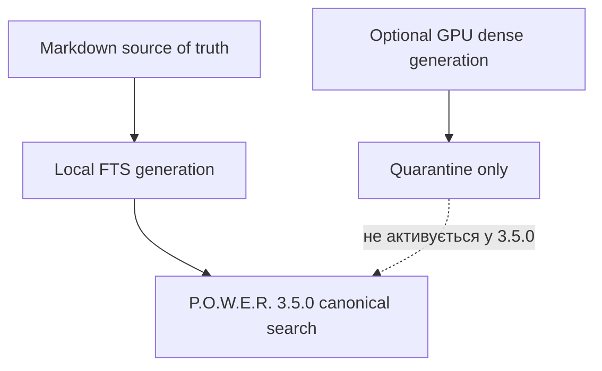

# ⚠️ Гібридний GPU-оффлоадинг: quarantine design note для 3.5++

> **Категорія паттерна:** Архітектура та Інфраструктурні Сценарії  
> **Цільова аудиторія:** Системні Архітектори, DevOps Інженери, Адміністратори Homelab, Оператори ШІ-Агентів  
> **Застосовність:** лише optional 3.5++; не є шляхом релізу lean 3.5.0.

> **Статус безпеки:** fleet transfer перебуває в quarantine. У POWER 3.5.0
> Markdown є source of truth, а локальний FTS — canonical retrieval path. Не
> копіюйте віддалене SQLite/cache-дерево у live vault: спершу потрібні підписаний
> manifest, quarantine import, exact source snapshot check та atomic activation.

---

## 🎯 1. Огляд та Постановка Проблеми

Розгортання гібридного пошуку та RAG (Retrieval-Augmented Generation) у гетерогенних апаратних середовищах стикається з фундаментальною інфраструктурною дилемою:

1. **Низькоспоживаючі 24/7 Сервери** (Міні-ПК, Edge-сервери, NAS, Raspberry Pi кластери):
   - **Сильні сторони:** 100% аптайм, низьке енергоспоживання (< 15–30 Вт), ідеально для безперервної доступності ШІ-агентів та Git-воркфлоу.
   - **Слабкі сторони:** Обмежені обчислювальні ресурси CPU; висока затримка при ембедингу 1024-вимірних векторів (BGE-M3) та виконанні моделей Cross-Encoder (XLM-RoBERTa).
2. **Високопродуктивні GPU Робочі Станції** (ПК з дискретними GPU NVIDIA CUDA):
   - **Сильні сторони:** Швидкі тензорні ядра GPU (субсекундний Cross-Encoder Reranking, висока швидкість генерації векторів).
   - **Слабкі сторони:** Високе енергоспоживання у режимі простою (300–600 Вт); періодичне вимкнення на ніч, у неробочі години або під час поїздок.

Ця нотатка фіксує відкладену ідею **асинхронного GPU-оффлоадингу**. Це не
інструкція встановлення і не обіцянка latency, power, transfer або safety. Підтриманий
workflow — локальний `power sync`; intermittent GPU host можна буде оцінити лише
через quarantine fleet track.

---

## 🏗️ 2. Схема Архітектури



---

## ⚙️ 3. Покрокове Налаштування

### Крок 1: Налаштування GPU Прискорення на Робочій Станції (NVIDIA CUDA)

На робочій станції з GPU налаштуйте P.O.W.E.R. для автоматичного використання `CUDAExecutionProvider`:

1. **Додайте змінні оточення** у `/etc/profile.d/power.sh` або `~/.bashrc`:
   ```bash
   # Вмикаємо CUDA провайдер для P.O.W.E.R.
   export POWER_EMBED_DEVICE="cuda"
   export POWER_EMBED_PROVIDER="bge-m3"

   # Додаємо бібліотеки cuDNN та cuBLAS у системний шлях
   export LD_LIBRARY_PATH="/path/to/venv/lib/python3.14/site-packages/nvidia/cudnn/lib:/path/to/venv/lib/python3.14/site-packages/nvidia/cublas/lib:$LD_LIBRARY_PATH"
   ```

2. **Зафіксуйте конфігурацію MCP-Сервера (`opencode.jsonc`):**
   ```json
   {
     "mcpServers": {
       "power": {
         "type": "local",
         "command": ["/path/to/power_mcp_supervisor.sh"],
         "environment": {
           "POWER_VAULT_DIR": "/path/to/vault",
           "POWER_EMBED_PROVIDER": "bge-m3",
           "POWER_EMBED_DEVICE": "cuda"
         }
       }
     }
   }
   ```

3. **Виконайте повну переіндексацію на GPU:**
   ```bash
   power sync /path/to/vault --force
   ```

---

### Крок 2: Fleet transfer перебуває в quarantine

Legacy helper `scripts/sync_brain_db_from_ws.sh` навмисно є no-op. Він не робить
SSH probe, не створює cache і не переносить database. Не відновлюйте старий
whole-cache pattern під іншою назвою. Майбутня реалізація спершу має визначити
artifact manifest, vault/source identity, exact snapshot hash, schema/model
compatibility, free-space policy, `.partial`, atomic activation та
rollback/readback receipts.

---

## 📊 4. Межа evidence

Fleet latency, transfer-size, power та cross-host corruption claims не входять
до evidence 3.5.0. Майбутнє порівняння має публікувати host, model lock, source
snapshot, generation identity, warm/cold state, failure cases та readback receipt;
synthetic numbers не можна видавати за production facts.

---

## 🔒 5. Кращі Практики та Операційні Правила

1. **Source identity:** Не виводьте compatibility з path, UUID, filename або WAL.
   Перевіряйте exact current source snapshot і signed artifact manifest.
2. **Quarantine first:** Приймайте artifact як `.partial`/quarantined data,
   перевіряйте integrity та compatibility, а last-good generation і FTS
   зберігайте до atomic activation/readback.
3. **Non-blocking release path:** Fleet/GPU offloading — optional 3.5++; його
   відсутність або degradation не може ламати local FTS search.

---
*Документація підтримується командою розробки P.O.W.E.R. Framework.*
