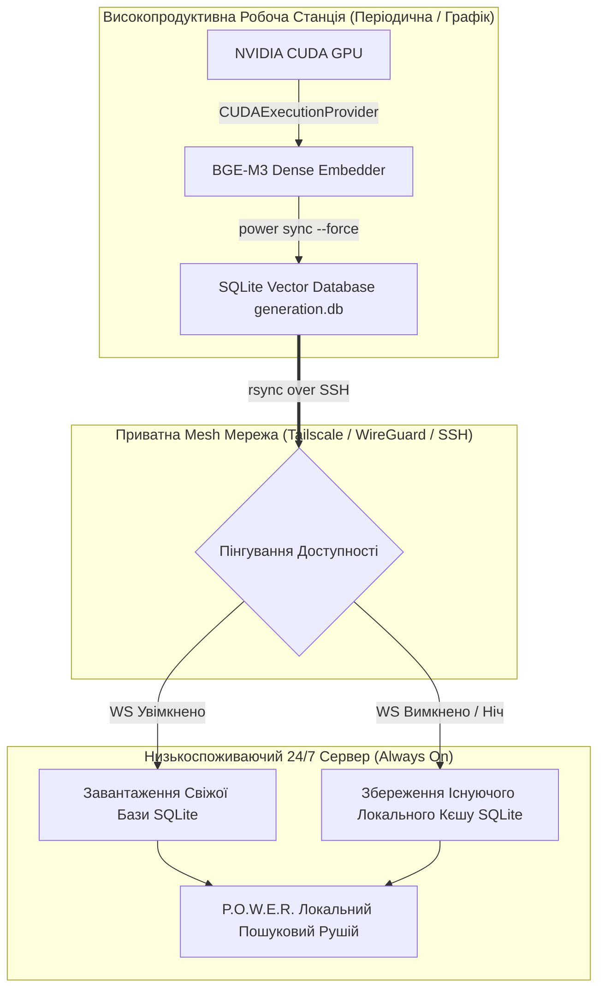

# 🚀 Гібридна Архітектура Флоту: Асинхронний GPU-Оффлоадинг Векторів для Робочих Станцій з Періодичним Графіком Роботи

> **Категорія паттерна:** Архітектура та Інфраструктурні Сценарії  
> **Цільова аудиторія:** Системні Архітектори, DevOps Інженери, Адміністратори Homelab, Оператори ШІ-Агентів  
> **Застосовність:** P.O.W.E.R. Framework 3.4.0+

---

## 🎯 1. Огляд та Постановка Проблеми

Розгортання гібридного пошуку та RAG (Retrieval-Augmented Generation) у гетерогенних апаратних середовищах стикається з фундаментальною інфраструктурною дилемою:

1. **Низькоспоживаючі 24/7 Сервери** (Міні-ПК, Edge-сервери, NAS, Raspberry Pi кластери):
   - **Сильні сторони:** 100% аптайм, низьке енергоспоживання (< 15–30 Вт), ідеально для безперервної доступності ШІ-агентів та Git-воркфлоу.
   - **Слабкі сторони:** Обмежені обчислювальні ресурси CPU; висока затримка при ембедингу 1024-вимірних векторів (BGE-M3) та виконанні моделей Cross-Encoder (XLM-RoBERTa).
2. **Високопродуктивні GPU Робочі Станції** (ПК з дискретними GPU NVIDIA CUDA):
   - **Сильні сторони:** Швидкі тензорні ядра GPU (субсекундний Cross-Encoder Reranking, висока швидкість генерації векторів).
   - **Слабкі сторони:** Високе енергоспоживання у режимі простою (300–600 Вт); періодичне вимкнення на ніч, у неробочі години або під час поїздок.

Цей посібник описує паттерн **«Асинхронний GPU-Оффлоадинг з Відмовостійкою Pull-Синхронізацією»**. Впровадження цієї архітектури дозволяє 24/7 серверу використовувати згенеровані на GPU векторні бази даних SQLite без потреби тримати потужну робочу станцію увімкненою цілодобово.

---

## 🏗️ 2. Схема Архітектури



---

## ⚙️ 3. Покрокове Налаштування

### Крок 1: Налаштування GPU Прискорення на Робочій Станції (NVIDIA CUDA)

На робочій станції з GPU налаштуйте P.O.W.E.R. для автоматичного використання `CUDAExecutionProvider`:

1. **Додайте змінні оточення** у `/etc/profile.d/power.sh` або `~/.bashrc`:
   ```bash
   # Вмикаємо CUDA провайдер для P.O.W.E.R.
   export POWER_EMBED_DEVICE="cuda"
   export POWER_EMBED_PROVIDER="bge-m3"

   # Додаємо бібліотеки cuDNN та cuBLAS у системний шлях
   export LD_LIBRARY_PATH="/path/to/venv/lib/python3.14/site-packages/nvidia/cudnn/lib:/path/to/venv/lib/python3.14/site-packages/nvidia/cublas/lib:$LD_LIBRARY_PATH"
   ```

2. **Зафіксуйте конфігурацію MCP-Сервера (`opencode.jsonc`):**
   ```json
   {
     "mcpServers": {
       "power": {
         "type": "local",
         "command": ["/path/to/power_mcp_supervisor.sh"],
         "environment": {
           "POWER_VAULT_DIR": "/path/to/vault",
           "POWER_EMBED_PROVIDER": "bge-m3",
           "POWER_EMBED_DEVICE": "cuda"
         }
       }
     }
   }
   ```

3. **Виконайте повну переіндексацію на GPU:**
   ```bash
   power sync /path/to/vault --force
   ```

---

### Крок 2: Відмовостійкий Скрипт Синхронізації на 24/7 Сервері

Оскільки робоча станція періодично вимикається, звичайний cron на робочій станції буде збіватись у неробочий час.

Замість цього **24/7 Сервер** запускає інтелектуальний скрипт, який спочатку перевіряє мережеву доступність робочої станції через SSH/Tailscale.

Створіть файл `/usr/local/bin/sync_vector_db_resilient.sh` на 24/7 Сервері:

```bash
#!/usr/bin/env bash
set -euo pipefail

# ------------------------------------------------------------------------------
# Універсальний Відмовостійкий Скрипт Синхронізації Векторної Бази
# Хост: 24/7 Сервер (Always-On)
# ------------------------------------------------------------------------------

# Конфігурація (Налаштуйте під ваш флот)
REMOTE_HOST="100.68.179.109"                  # IP або Hostname робочої станції
REMOTE_USER="root"                             # Користувач SSH
VAULT_UUID="9fbead1a-5b14-413f-814a-4f37af5656bc" # UUID ваулту P.O.W.E.R
SSH_TIMEOUT=3                                  # Таймаут пінгування у секундах

LOCAL_CACHE_DIR="/root/.cache/power-framework/vaults/${VAULT_UUID}"
REMOTE_CACHE_DIR="/root/.cache/power-framework/vaults/${VAULT_UUID}"

echo "🔍 Перевірка доступності GPU Робочої Станції (${REMOTE_HOST})..."

if ssh -o "ConnectTimeout=${SSH_TIMEOUT}" -o "BatchMode=yes" "${REMOTE_USER}@${REMOTE_HOST}" "echo online" >/dev/null 2>&1; then
    echo "⚡ Робоча станція УВІМКНЕНА! Синхронізація GPU-згенерованої бази даних..."
    mkdir -p "${LOCAL_CACHE_DIR}"
    rsync -avz --update "${REMOTE_USER}@${REMOTE_HOST}:${REMOTE_CACHE_DIR}/" "${LOCAL_CACHE_DIR}/"
    echo "✅ Синхронізація векторної бази даних успішно завершена!"
else
    echo "ℹ️ Робоча станція ВИМКНЕНА (на ніч або у стані сну). Безпечне збереження локального кєшу."
fi
```

Зробіть скрипт виконуваним:
```bash
chmod +x /usr/local/bin/sync_vector_db_resilient.sh
```

---

## 📊 4. Порівняння Ефективності та Метрики

Емпіричні бенчмарки на вольті з 727 нотаток (5,623 вектори BGE-M3 1024d) демонструють високу ефективність цієї гібридної схеми:

| Операція | 24/7 Низькоспоживаючий Сервер (CPU) | Робоча Станція (NVIDIA CUDA GPU) | Архітектурний Ефект |
| :--- | :--- | :--- | :--- |
| **Генерація Векторних Ембедингів** | ~15–20 хвилин (CPU) | **< 35 секунд (GPU)** | 30x прискорення індексації |
| **Семантичний Пошук (P95 Latency)** | 1265.7 ms | **456.8 ms** | 2.77x скорочення латентності |
| **Cross-Encoder Reranking (P50)** | 87,822 ms | **985.0 ms** | **89.2x прискорення** ⚡ |
| **Передача Індексу Мережею (rsync)** | N/A | **7.5 секунд (177 MB)** | Миттєва гідрація бази |
| **Енергоспоживання 24/7** | **~15 Вт (Низьке)** | **0 Вт (Вимкнено на ніч)** | **0 Вт витрат GPU у простої** |

---

## 🔒 5. Кращі Практики та Операційні Правила

1. **Детерміновані UUID Ваултів:** P.O.W.E.R. розраховує UUID ваулту детерміновано, що гарантує 100% сумісність `.db` файлів генерації між різними хостами.
2. **Безпека WAL у SQLite:** Режим SQLite WAL гарантує, що виконання `rsync` під час активних запитів пошуку на 24/7 сервері не призводить до пошкодження бази даних.
3. **Автоматичний Таймер:** На 24/7 сервері додайте виклик скрипта у systemd timer або cron кожні 30 хвилин. Якщо робоча станція вимкнена, скрипт завершується за < 3 секунди без створення помилок у логах.

---
*Документація підтримується командою розробки P.O.W.E.R. Framework.*
